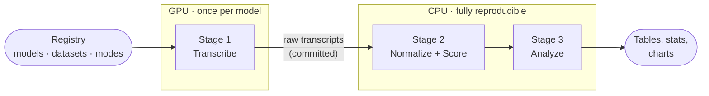

<h1 align="center">Indian-ASR-Bench</h1>

<p align="center">
  
  
  
  
  <a href="https://huggingface.co/theshivam7">
    
  </a>
</p>

<p align="center">
  <b>A reproducible Word Error Rate benchmark for ASR on Indian English speech:<br>
  three datasets, nine models each, up to five normalization modes, and a fine-tuning capacity study across model sizes.</b>
</p>

<p align="center">
  <a href="#key-features">Features</a> &nbsp;·&nbsp;
  <a href="#datasets">Datasets</a> &nbsp;·&nbsp;
  <a href="#models">Models</a> &nbsp;·&nbsp;
  <a href="#pipeline">Pipeline</a> &nbsp;·&nbsp;
  <a href="#results">Results</a> &nbsp;·&nbsp;
  <a href="#installation">Installation</a> &nbsp;·&nbsp;
  <a href="#usage">Usage</a> &nbsp;·&nbsp;
  <a href="SUMMARY.md">Full analysis</a>
</p>

---

## Overview

Most ASR benchmarks focus on American and British English. Indian English is spoken by over a
billion people and gets far less evaluation attention, and academic lecture speech makes it
harder still: fast delivery, dense technical vocabulary, real-world recording conditions.

This project runs the same nine ASR systems across three Indian-English corpora under an
identical, registry-driven pipeline, then asks how much of the reported WER is the model versus
the evaluation choices around it: reference field, normalizer, and dataset artifacts.

One number to start with: the reference and normalizer you score against can move a model as
much as swapping the model itself. Full detail in [Normalization](SUMMARY.md#normalization).

## Key features

- Three datasets share one pipeline: TIE_shorts (scraped lecture speech), Svarah (curated read speech), and the AESRC2020 Indian subset (short prompted speech), all scored identically.
- Nine pretrained models run head to head: Whisper across five sizes, both Parakeet variants (TDT and CTC), and Qwen3-ASR.
- Up to five normalization modes apply symmetrically to reference and hypothesis, so ranking artifacts from text cleanup are visible instead of hidden.
- Significance testing uses a speaker- or recording-clustered paired bootstrap, Holm-corrected across every pairwise model comparison.
- A cross-model consensus classifier flags reference/audio mismatches from agreement patterns across all nine models, without hand review.
- A fine-tuning capacity study covers Tiny, Small, and Medium on both a speaker-matched test set (TIE) and a natively speaker-disjoint one (AESRC).
- Every table and chart regenerates on CPU from the committed Stage-1 transcripts; no GPU or re-transcription needed.

---

## Datasets

| Dataset | Type | Test clips | Link |
|---|---|:---:|---|
| TIE_shorts | Scraped NPTEL lecture audio | 986 | [HF Hub](https://huggingface.co/datasets/raianand/TIE_shorts) |
| Svarah | Curated read-speech prompts | 6,656 | [HF Hub](https://huggingface.co/datasets/ai4bharat/Svarah) |
| AESRC2020 (Indian subset) | Short prompted read speech | 1,731 | [HF Hub](https://huggingface.co/datasets/pengyizhou/accented_english) |

Full split sizes, durations, and demographic breakdowns (gender, region, speech rate, age, native
language): [SUMMARY.md, Datasets](SUMMARY.md#datasets).

---

## Models

| Model | Params | Architecture |
|---|:---:|:---:|
| Whisper Tiny / Base / Small / Medium / Large-v3 / large-v3-turbo | 39M–1.5B | Encoder-Decoder |
| Parakeet-TDT-0.6B-v2 | 600M | CTC + TDT |
| Parakeet-CTC-1.1B | 1.1B | CTC |
| Qwen3-ASR-1.7B | 1.7B | LLM-based |

All nine run as-is on all three datasets; that is the headline benchmark. Six more (Whisper
Tiny/Small/Medium, fine-tuned separately on TIE and on AESRC) are published on the [Hugging Face
Hub](https://huggingface.co/theshivam7) and analyzed in [Fine-tuning](SUMMARY.md#fine-tuning-pretrained-vs-fine-tuned-across-sizes).
Full model table with parameter counts and links: [SUMMARY.md, Models](SUMMARY.md#models).

---

## Pipeline

One registry-driven pipeline runs identically on every dataset. Only the loading step is dataset-specific.



Stage 1 is committed and immutable, the reproducibility anchor. Any normalization or metric
change re-runs Stages 2 and 3 straight from those committed transcripts, no re-inference needed.
Adding a dataset or model is a one-line registry entry. Stage table and decode-config detail:
[SUMMARY.md, Pipeline in detail](SUMMARY.md#pipeline-in-detail).

---

## Results

Corpus WER under `transcript_clean` (gold, symmetric normalization), best model per dataset:

| Dataset | Best model | Corpus WER | Runner-up |
|---|---|:---:|---|
| TIE_shorts | Whisper Medium | **14.76%** | Parakeet-TDT-0.6B-v2 (15.60%) |
| Svarah | Whisper Large-v3 | **7.11%** | Whisper Medium (7.89%) |
| AESRC2020 (Indian) | Whisper Large-v3 | **5.20%** | Qwen3-ASR-1.7B (5.23%) |

A few things stood out across all three datasets:

- Bigger is not always better: on TIE, WER falls from Tiny to Medium, then rises again at Large-v3, and a smaller model wins outright.
- The median clip beats corpus WER by 3 to 12 pp; a small tail of severe misses, largely reference artifacts, pulls the average up.
- Fine-tuning showed no significant gain on TIE (speaker-matched test set) but did on AESRC (speaker-disjoint test set) for Small and Medium. The null result is a property of the test setup, not of fine-tuning itself.

Full leaderboards, confidence intervals, significance tests, demographic breakdowns, normalization
sensitivity, error-artifact analysis, and the complete fine-tuning study:
**[→ SUMMARY.md](SUMMARY.md)**

---

## Installation

```bash
git clone https://github.com/theshivam7/indian-asr-bench && cd indian-asr-bench
pip install -r requirements.txt
```

Requires Python 3.10+. GPU-specific extras (Whisper, Parakeet/NeMo, Qwen3) live in
`environments/*.yaml` and `*/requirements.txt`; only needed for re-transcription, not for scoring
or analysis.

---

## Usage

**Analysis only (no GPU).** Recompute every table and chart from the committed transcripts:

```bash
python normalize_and_score.py --dataset tie      # Stage 2
python analysis/compare_all.py --dataset tie     # Stage 3 tables + charts
python analysis/statistics.py --dataset tie      # cluster-bootstrap CIs + Holm-corrected tests
python analysis/error_analysis.py --dataset tie  # artifact taxonomy + instrument audit
python analysis/compare_finetune.py              # fine-tuning report (TIE; --dataset aesrc for AESRC)
```

Repeat with `--dataset svarah` or `--dataset aesrc` for the other two corpora.

**Transcription (GPU).** Registry-driven drivers with `--model` and `--dataset`:

```bash
bash whisper_asr/setup.sh                                              # one env for all Whisper models
python whisper_asr/run_whisper.py --model large_v3_turbo --dataset tie
python parakeet/wer_parakeet.py --model parakeet_ctc --dataset tie
python qwen3/wer_qwen3.py --dataset svarah
```

**On a cluster (NSCC / PBS Pro).** One command submits every remaining experiment with dependency chaining:

```bash
hf auth login                                           # once, Svarah is gated
PROJECT=<nscc_project_id> bash hpc/submit_all.sh        # add --setup to also create the conda envs
```

Or drive pieces individually: `qsub -P <id> -v DATASET=svarah hpc/run_pipeline.pbs` (full run),
`qsub -P <id> -v DATASET=tie hpc/job_score.pbs` (CPU-only re-scoring). See [`hpc/README.md`](hpc/README.md).

**Fine-tuning (GPU).** Official split, per model size:

```bash
bash finetune/setup.sh
python finetune/finetune_medium.py                                    # Medium
MODEL_NAME=medium_hf python finetune/evaluate_finetuned.py
MODEL_NAME=medium_ft python finetune/evaluate_finetuned.py

python finetune/finetune_tiny_small.py \
    --base-model openai/whisper-tiny --output-dir models/whisper_tiny_ft
MODEL_NAME=tiny_hf python finetune/evaluate_finetuned.py
MODEL_NAME=tiny_ft MODEL_SOURCE=models/whisper_tiny_ft python finetune/evaluate_finetuned.py
```

Or on the cluster: `qsub -v SIZE=tiny hpc/job_finetune_size.pbs` (or `SIZE=small`). Conda specs
live in [`environments/`](environments/), PBS jobs in [`hpc/`](hpc/). All runs used a single
NVIDIA A100-40GB (NSCC ASPIRE2A).

---

## Repository structure

```
indian-asr-bench/
├── utils/               registry, normalization, WER computation, dataset loading
├── whisper_asr/         Whisper transcription driver
├── parakeet/            NeMo Parakeet transcription driver
├── qwen3/               Qwen3-ASR transcription driver
├── finetune/            fine-tuning + evaluation scripts
├── analysis/            Stage 3: comparisons, statistics, error analysis, human-eval protocol
├── results/<dataset>/   stage1_raw_transcripts/, stage2_processed/, analysis/
├── hpc/                 PBS job scripts + runbook for NSCC
├── environments/        conda env specs per engine
├── tests/               pytest suite
└── archived_tasks/      exploratory work kept for reference (YouTube captions, etc.)
```

---

## Author

Shivam Sharma

Developed during a research internship at Nanyang Technological University (NTU), Singapore,
under the supervision of Liu Changsong.

---

<p align="center">
  MIT licensed, see <a href="LICENSE">LICENSE</a>. Datasets (<a href="https://huggingface.co/datasets/raianand/TIE_shorts">TIE_shorts</a>, <a href="https://huggingface.co/datasets/ai4bharat/Svarah">Svarah</a>, <a href="https://huggingface.co/datasets/pengyizhou/accented_english">accented_english</a>) keep their own licenses.<br>
  Full results and analysis: <a href="SUMMARY.md">SUMMARY.md</a>. Contributions welcome, see <a href="CONTRIBUTING.md">CONTRIBUTING.md</a>.
</p>
