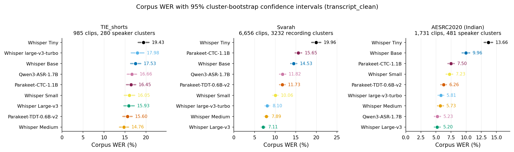
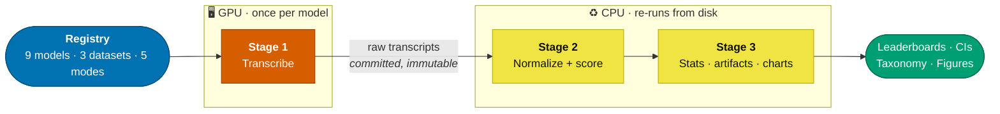

<h1 align="center">Indian-ASR-Bench</h1>

<p align="center">
  
  
  
  
  
  <a href="https://huggingface.co/theshivam7">
    
  </a>
</p>

<p align="center">
  <b>A reproducible Word Error Rate benchmark for ASR on Indian English speech:<br>
  three datasets, nine models each, up to five normalization modes, and a seed-replicated fine-tuning capacity study across model sizes.</b>
</p>

<p align="center">
  <a href="#key-features">Features</a> &nbsp;·&nbsp;
  <a href="#datasets">Datasets</a> &nbsp;·&nbsp;
  <a href="#models">Models</a> &nbsp;·&nbsp;
  <a href="#pipeline">Pipeline</a> &nbsp;·&nbsp;
  <a href="#results">Results</a> &nbsp;·&nbsp;
  <a href="#installation">Installation</a> &nbsp;·&nbsp;
  <a href="#usage">Usage</a> &nbsp;·&nbsp;
  <a href="SUMMARY.md">Full analysis</a>
</p>

<p align="center">
  
</p>

<p align="center">
  <sub>The same nine systems, reordered by every corpus. Whisper Medium wins on scraped lecture
  audio and Large-v3 on both curated corpora; on TIE the top five overlap inside their confidence
  intervals. Regenerate with <code>python analysis/make_overview_figure.py</code>.</sub>
</p>

---

## Overview

Most ASR benchmarks focus on American and British English. Indian English is spoken by over a
billion people and gets far less evaluation attention, and academic lecture speech makes it
harder still: fast delivery, dense technical vocabulary, real-world recording conditions.

This project runs the same nine ASR systems across three Indian-English corpora under an
identical, registry-driven pipeline, then asks how much of the reported WER is the model versus
the evaluation choices around it: reference field, normalizer, and dataset artifacts.

One number to start with: the reference and normalizer you score against can move a model as
much as swapping the model itself. Full detail in [Normalization](SUMMARY.md#normalization).

## Key features

- Three datasets share one pipeline: TIE_shorts (scraped lecture speech), Svarah (curated read speech), and the AESRC2020 Indian subset (short prompted speech), all scored identically.
- Nine pretrained models run head to head: Whisper across five sizes, both Parakeet variants (TDT and CTC), and Qwen3-ASR.
- Up to five normalization modes apply symmetrically to reference and hypothesis, so ranking artifacts from text cleanup are visible instead of hidden.
- Significance testing uses a speaker- or recording-clustered paired bootstrap, Holm-corrected across every pairwise model comparison, and is run under both normalizers rather than only the primary one.
- A cross-model consensus classifier flags reference/audio mismatches from agreement patterns across all nine models, without hand review.
- Split design is treated as an evaluation-validity property: TIE's official splits are shown to be speaker-entangled, and the fine-tuning capacity study (Tiny, Small, Medium) runs on AESRC, whose test set is natively speaker-disjoint from training.
- Inference cost sits next to accuracy: real-time factor, latency percentiles and peak GPU memory for all nine models, timed on one fixed 200-clip TIE subset under an identical protocol, so speed comparisons are like-for-like rather than anecdotal.
- Every table and chart regenerates on CPU from the committed Stage-1 transcripts; no GPU or re-transcription needed.

---

## Datasets

| Dataset | Type | Test clips | Link |
|---|---|:---:|---|
| TIE_shorts | Scraped NPTEL lecture audio | 986 | [HF Hub](https://huggingface.co/datasets/raianand/TIE_shorts) |
| Svarah | Curated read-speech prompts | 6,656 | [HF Hub](https://huggingface.co/datasets/ai4bharat/Svarah) |
| AESRC2020 (Indian subset) | Short prompted read speech | 1,731 | [HF Hub](https://huggingface.co/datasets/pengyizhou/accented_english) |

Full split sizes, durations, and demographic breakdowns (gender, region, speech rate, age, native
language): [SUMMARY.md, Datasets](SUMMARY.md#datasets).

---

## Models

| Model | Params | Architecture |
|---|:---:|:---:|
| Whisper Tiny / Base / Small / Medium / Large-v3 / large-v3-turbo | 39M–1.5B | Encoder-Decoder |
| Parakeet-TDT-0.6B-v2 | 600M | CTC + TDT |
| Parakeet-CTC-1.1B | 1.1B | CTC |
| Qwen3-ASR-1.7B | 1.7B | LLM-based |

All nine run as-is on all three datasets; that is the headline benchmark. Fine-tuned checkpoints
are published on the [Hugging Face Hub](https://huggingface.co/theshivam7) and analyzed in
[Fine-tuning and split design](SUMMARY.md#fine-tuning-and-split-design).
Full model table with parameter counts and links: [SUMMARY.md, Models](SUMMARY.md#models).

### Released checkpoints

| Repo | What it is | Use it? |
|---|---|:---:|
| [whisper-tiny-aesrc-indian-english](https://huggingface.co/theshivam7/whisper-tiny-aesrc-indian-english) | AESRC fine-tune, single curated run | yes |
| [whisper-small-aesrc-indian-english](https://huggingface.co/theshivam7/whisper-small-aesrc-indian-english) | AESRC fine-tune, single curated run | yes |
| [whisper-medium-aesrc-indian-english](https://huggingface.co/theshivam7/whisper-medium-aesrc-indian-english) | AESRC fine-tune, single curated run | yes |
| [whisper-tiny-aesrc-indian-english-seeds](https://huggingface.co/theshivam7/whisper-tiny-aesrc-indian-english-seeds) | the 6 seed reruns behind the Tiny row above | research only |
| [whisper-small-aesrc-indian-english-seeds](https://huggingface.co/theshivam7/whisper-small-aesrc-indian-english-seeds) | the 6 seed reruns behind the Small row above | research only |
| [whisper-medium-aesrc-indian-english-seeds](https://huggingface.co/theshivam7/whisper-medium-aesrc-indian-english-seeds) | the 6 seed reruns behind the Medium row above | research only |
| [whisper-tiny-indian-english](https://huggingface.co/theshivam7/whisper-tiny-indian-english) | TIE fine-tune, speaker-entangled split | see caveat |
| [whisper-small-indian-english](https://huggingface.co/theshivam7/whisper-small-indian-english) | TIE fine-tune, speaker-entangled split | see caveat |
| [whisper-medium-indian-english](https://huggingface.co/theshivam7/whisper-medium-indian-english) | TIE fine-tune, speaker-entangled split | see caveat |

The three TIE checkpoints are published for completeness and carry a disclosure on their model
cards: TIE's official split places 100% of test speakers in train, so no WER measured on it can be
attributed to accent or domain adaptation. That study is [archived, not
reported](archived_tasks/tie_finetuning/README.md). For Indian-English fine-tuning, use the AESRC
models.

---

## Pipeline

One registry-driven pipeline runs identically on every dataset. Only the loading step is dataset-specific.



Stage 1 is committed and immutable, the reproducibility anchor. Any normalization or metric
change re-runs Stages 2 and 3 straight from those committed transcripts, no re-inference needed.
That is why the hero chart above, every table in [SUMMARY.md](SUMMARY.md), and every figure in
the paper rebuild on a laptop in minutes. Adding a dataset or model is a one-line registry entry.
Stage table and decode-config detail: [SUMMARY.md, Pipeline in detail](SUMMARY.md#pipeline-in-detail).

---

## Results

Corpus WER under `transcript_clean` (gold, symmetric normalization), best model per dataset:

| Dataset | Best model | Corpus WER | Runner-up |
|---|---|:---:|---|
| TIE_shorts | Whisper Medium | **14.76%** | Parakeet-TDT-0.6B-v2 (15.60%) |
| Svarah | Whisper Large-v3 | **7.11%** | Whisper Medium (7.89%) |
| AESRC2020 (Indian) | Whisper Large-v3 | **5.20%** | Qwen3-ASR-1.7B (5.23%) |

A few things stood out across all three datasets:

- Bigger is not always better: on TIE, WER falls from Tiny to Medium, then rises again at Large-v3, and a smaller model wins outright.
- The median clip beats corpus WER by 3 to 12 pp; a small tail of severe misses, largely reference artifacts, pulls the average up.
- Human-verified check on TIE's 49 clips hardest for every model: correcting the reference drops mean WER on that subset from 64.8% to 17.0% (Wilcoxon p < 1e-8, every model individually significant after Holm correction). 46 of 49 clips trace to a bad reference, not a model failure. See [Classifier validation (human review)](SUMMARY.md#classifier-validation-human-review) in SUMMARY.md.
- The normalizer changes conclusions, not just numbers: 5 of 36 Holm-corrected pairwise verdicts on TIE flip depending on which normalizer is used, against 0 of 36 on either curated corpus. What drives it is how tightly the leaderboard is packed, not how far WER moves.
- Fine-tuning helps at every model size on AESRC's speaker-disjoint test set, so the gain is generalization to unseen speakers rather than memorization. The same question is unanswerable on TIE, whose official splits put every test speaker in training.
- The fine-tuning gain shrinks as the pretrained model grows: -39.3% relative at Tiny, -22.8% at Small, -21.7% at Medium. A bigger pretrained model has less WER left to recover.
- Cost separates these systems far more than accuracy does: real-time factor spans 23.9x across the nine, against 1.32x for TIE corpus WER. What predicts inference cost is decoder class, not parameter count. See [Inference efficiency](SUMMARY.md#inference-efficiency) in SUMMARY.md.

Fine-tuning, all three sizes retrained from 6 seeds each on AESRC's speaker-disjoint test set
(`transcript_clean`; all 18 runs improve on their own baseline, and so do all 18 under the Whisper
normalizer):

| Size | Baseline WER | Fine-tuned (6-seed mean) | Δ mean | Δ SD | Δ range | Single-split significance |
|---|:---:|:---:|:---:|:---:|:---:|:---:|
| Whisper Tiny (39M) | 17.45% | 10.60% | **-6.85 pp** | 1.03 | -7.34 to -4.75 | CI crosses zero (p<sub>Holm</sub>=0.163) |
| Whisper Small (244M) | 7.22% | 5.58% | **-1.65 pp** | 0.15 | -1.84 to -1.42 | significant (p<sub>Holm</sub>=0.003) |
| Whisper Medium (769M) | 5.63% | 4.41% | **-1.22 pp** | 0.12 | -1.32 to -1.00 | significant (p<sub>Holm</sub>=0.003) |

The across-seed spread and the clip-level bootstrap CI measure different things and are reported
separately, never pooled. Tiny's 1.03 pp SD is one anomalous seed against five inside a 0.12 pp
band, which the [per-seed table](results/aesrc/analysis/finetune_seeds_transcript_clean.md) shows
directly.

Full leaderboards, confidence intervals, significance tests, demographic breakdowns, normalization
sensitivity, error-artifact analysis, and the complete fine-tuning study:
**[→ SUMMARY.md](SUMMARY.md)**

---

## Installation

```bash
git clone https://github.com/theshivam7/indian-asr-bench && cd indian-asr-bench
pip install -r requirements.txt
```

Requires Python 3.10+. That is everything needed to reproduce every table and chart, because
Stage 1 transcripts are committed.

Re-transcribing or fine-tuning needs GPU environments, and **each engine needs its own**:
openai-whisper, NeMo and the Qwen3 stack cannot coexist in one environment, and the fine-tuning
stack pins newer versions than any of them. That is why `whisper_asr/`, `parakeet/`, `qwen3/` and
`finetune/` each ship a separate `requirements.txt` whose pins deliberately disagree with each
other. Install them with the matching `setup.sh`, and do not align the versions across files.
Full conda specs are in [`environments/`](environments/), and the exact package sets the published
results were produced with are in [`environments/resolved/`](environments/resolved/), captured from
the cluster itself. Use those if the two engine `.yaml` files fail to solve, which they now do.

---

## Usage

Every command takes `--dataset {tie,svarah,aesrc}`. Only Stage 1 needs a GPU; everything
else recomputes on CPU from the committed transcripts.

### Reproduce the results (no GPU)

```bash
python normalize_and_score.py     --dataset tie    # Stage 2: normalize + score
python analysis/compare_all.py    --dataset tie    # Stage 3: tables + charts
python analysis/statistics.py     --dataset tie    # cluster-bootstrap CIs, Holm-corrected
python analysis/error_analysis.py --dataset tie    # artifact taxonomy + instrument audit
python analysis/compare_finetune.py --dataset aesrc  # fine-tuning report
```

`statistics.py` defaults to the pre-registered primary mode. Add `--mode whisper_norm` to
reproduce the cross-normalizer comparison where 5 of 36 TIE verdicts flip.

<details>
<summary><b>Expected output</b> from the first command</summary>

Corpus WER per model across every applicable mode, then the summary path. The numbers
below are the committed ones, so a fresh checkout reproduces them exactly:

```
model            transcript_raw  transcript_clean  hf_raw  hf_clean  whisper_norm
...
medium                   15.11             14.76   18.01     15.76         14.48
parakeet                 15.97             15.60   18.54     16.40         15.17
tiny                     19.79             19.43   22.20     20.07         19.01

Saved summary to results/tie/stage2_processed
Done.
```

Anything other than `14.76` for `medium` under `transcript_clean` means something has
drifted; CI checks exactly this on every push.
</details>

### Transcribe with a model (GPU)

```bash
bash whisper_asr/setup.sh                          # one env for all Whisper sizes
python whisper_asr/run_whisper.py  --model large_v3_turbo --dataset tie
python parakeet/wer_parakeet.py    --model parakeet_ctc   --dataset tie
python qwen3/wer_qwen3.py                                 --dataset svarah
```

Each engine needs its own environment; see [Installation](#installation).

### Fine-tune (GPU)

AESRC is the corpus used here because its test speakers are disjoint from training, which
is what makes a measured gain attributable.

```bash
bash finetune/setup.sh

# train
python finetune/finetune_tiny_small.py --dataset aesrc \
    --base-model openai/whisper-tiny --output-dir models/whisper_tiny_aesrc_ft

# evaluate the fine-tune against its own pretrained baseline, same pipeline
DATASET=aesrc MODEL_NAME=tiny_hf       MODEL_SOURCE=openai/whisper-tiny            python finetune/evaluate_finetuned.py
DATASET=aesrc MODEL_NAME=tiny_aesrc_ft MODEL_SOURCE=models/whisper_tiny_aesrc_ft   python finetune/evaluate_finetuned.py
```

### Replicate across seeds (GPU)

One seed cannot separate a real effect from run-to-run noise, so each size is trained
across six and reported as mean and standard deviation.

```bash
bash finetune/run_seeds.sh --size tiny --dataset aesrc   # seeds 42-47
python analysis/compare_seeds.py --dataset aesrc --mode all
```

The runner skips seeds that are already scored, so resubmitting after a walltime kill
resumes rather than restarts. The across-seed spread is reported separately from the
within-run bootstrap CI, because they measure different things and pooling them would
misstate both.

### Benchmark inference cost (GPU)

Real-time factor, latency percentiles, throughput and peak GPU memory, measured on a
seeded clip subset so every model sees identical audio.

```bash
python whisper_asr/run_whisper.py --model medium   --dataset tie --efficiency
python parakeet/wer_parakeet.py   --model parakeet --dataset tie --efficiency
python qwen3/wer_qwen3.py                          --dataset tie --efficiency
python analysis/compare_efficiency.py              --dataset tie   # merge into one table
```

Keep `--clips` and `--seed` identical across models. The aggregator refuses to present
runs measured on different subsets or different GPUs as one comparable table.

### On a cluster (NSCC / PBS Pro)

```bash
hf auth login                                        # once, Svarah is gated
PROJECT=<nscc_project_id> bash hpc/submit_all.sh     # --setup also creates the conda envs
```

Individual jobs, if you prefer to drive them yourself:

| Job | Command |
|---|---|
| Full pipeline | `qsub -P <id> -v DATASET=svarah hpc/run_pipeline.pbs` |
| Re-score only (CPU) | `qsub -P <id> -v DATASET=tie hpc/job_score.pbs` |
| Fine-tune one size | `qsub -P <id> -v SIZE=tiny,DATASET=aesrc hpc/job_finetune_size.pbs` |
| Seed sweep | `qsub -P <id> -v SIZE=tiny hpc/job_finetune_seeds.pbs` |
| Efficiency | `qsub -P <id> -v ENGINE=whisper,MODEL=medium hpc/job_efficiency.pbs` |

Conda specs are in [`environments/`](environments/), PBS jobs and the runbook in
[`hpc/`](hpc/). All reported runs used a single NVIDIA A100-40GB (NSCC ASPIRE2A).

---

## Troubleshooting

Every entry below is a failure that actually occurred while building this benchmark, not a
hypothetical.

**`Feature type 'List' not found` when loading a dataset.** Your `datasets` is on 3.x and the
cache was written by 4.x. The two are not interchangeable and the error names neither. Pin the
version in `requirements.txt`: `pip install 'datasets==4.8.5'`.

**`ImportError: To support encoding audio data, please install 'torchcodec'` when running
pytest.** `datasets` 4.x routes `Audio` encoding through `torchcodec`, which ships with the
engine environments rather than `requirements.txt`. The affected tests skip themselves in an
analysis-only environment; if you want them to run, install an engine environment
(`bash whisper_asr/setup.sh`). Nothing in the analysis pipeline needs it, because
`utils/io_helpers.raw_audio_column` reads the arrow column directly to bypass the feature.

**`conda env create -f environments/parakeet.yaml` fails to solve.** Channel drift has made the
MKL / llvm-openmp / mkl_random build hashes in that spec and in `qwen3.yaml` mutually
unsatisfiable. Use [`environments/resolved/`](environments/resolved/) instead, which carries the
exact package sets captured from the cluster that produced the published results.

**`torch.cuda.is_available()` returns `False` inside a job.** A pip-installed torch does not
reliably see the GPU on an A100 cluster. The conda build string has to be pinned:
`pytorch-2.5.1-py3.10_cuda11.8_cudnn9.1.0_0`, which `environments/resolved/whisper.explicit.txt`
already carries. On a login node this is expected and uninformative, since login nodes have no
GPU.

**Whisper produces empty transcripts for some clips, giving ~100% WER on those.** `openai-whisper`
shells out to `ffmpeg` per clip and a missing binary fails silently per clip rather than crashing
the run. Check with `conda run -n whisper which ffmpeg`, and install with
`conda install -n whisper -c conda-forge ffmpeg`.

**`Disk quota exceeded` on an HPC cluster.** Three separate caches default into `$HOME`:
`HF_HOME`/`HF_DATASETS_CACHE`, `XDG_CACHE_HOME` (openai-whisper's own cache, which does not
follow `HF_HOME`), and `CONDA_PKGS_DIRS`. The PBS jobs redirect all three; running by hand does
not. See [`hpc/NSCC_RUNBOOK.md`](hpc/NSCC_RUNBOOK.md).

**Your cluster account gets blocked.** NSCC's fair-share monitor kills processes on login nodes
automatically, and repeated violations can block an account. Anything that loads a model or
decodes audio belongs in a job, including a thirty-second probe. Request an interactive node with
`qsub -I` first.

**Svarah downloads fail with 401 or 403.** It is a gated dataset. Run `hf auth login` once, or
export `HF_TOKEN`, before submitting.

**Numbers do not match the committed results.** Stage 1 decoding uses temperature fallback and is
stochastic, so re-transcribing will not reproduce transcripts exactly. That is why Stage 1 is
committed and treated as the anchor. Stages 2 and 3 are deterministic: if they disagree with the
committed files, that is a real regression and CI will catch it.

---

## Repository structure

```
indian-asr-bench/
├── normalize_and_score.py   Stage 2 entry point: normalize + score from committed transcripts
├── utils/               registry, normalization, WER computation, dataset loading, efficiency probes
├── whisper_asr/         Whisper transcription driver (--efficiency for speed/memory)
├── parakeet/            NeMo Parakeet transcription driver (--efficiency)
├── qwen3/               Qwen3-ASR transcription driver (--efficiency)
├── finetune/            fine-tuning, multi-seed runner, evaluation scripts
├── analysis/            Stage 3: comparisons, statistics, error analysis, efficiency, seeds
│   └── tie_validation/  human review of TIE's 49 hardest clips, validates the artifact classifier
├── results/<dataset>/   stage1_raw_transcripts/, stage2_processed/, analysis/
├── hpc/                 PBS job scripts + NSCC runbook
├── environments/        conda env specs per engine
├── scripts/             smoke test
├── tests/               pytest suite (41 tests)
└── archived_tasks/      exploratory work SUMMARY.md still cites (TIE fine-tuning, YouTube captions)
```

---

## Authors

**Shivam Sharma** &nbsp;·&nbsp; Nanyang Technological University, Singapore
[`@theshivam7`](https://github.com/theshivam7) on GitHub, [`theshivam7`](https://huggingface.co/theshivam7) on Hugging Face

**Changsong Liu** &nbsp;·&nbsp; Nanyang Technological University, Singapore
Supervisor

🎓 Built during a research internship at NTU Singapore.
⚡ Compute provided by the National Supercomputing Centre (NSCC) Singapore, ASPIRE2A.

---

<p align="center">
  <a href="SUMMARY.md"><b>Full results and analysis</b></a>
  &nbsp;·&nbsp;
  <a href="CONTRIBUTING.md"><b>Contributing</b></a>
  &nbsp;·&nbsp;
  <a href="https://huggingface.co/theshivam7"><b>Models</b></a>
  &nbsp;·&nbsp;
  <a href="https://github.com/theshivam7/indian-asr-bench/releases"><b>Releases</b></a>
</p>

<p align="center">
  <sub>
    Code released under the <a href="LICENSE">MIT License</a>.
    Each dataset keeps its own terms:
    <a href="https://huggingface.co/datasets/raianand/TIE_shorts">TIE_shorts</a>,
    <a href="https://huggingface.co/datasets/ai4bharat/Svarah">Svarah</a>,
    <a href="https://huggingface.co/datasets/pengyizhou/accented_english">accented_english</a>.
  </sub>
</p>
