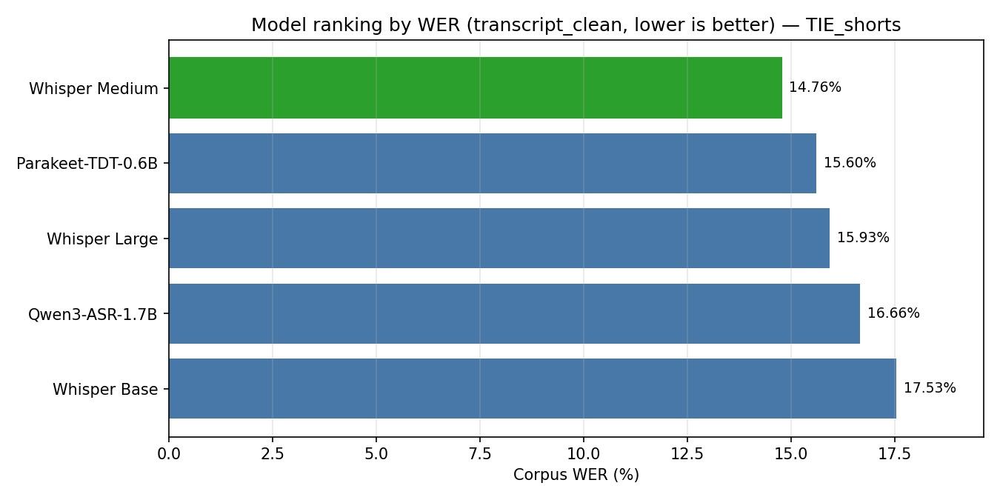
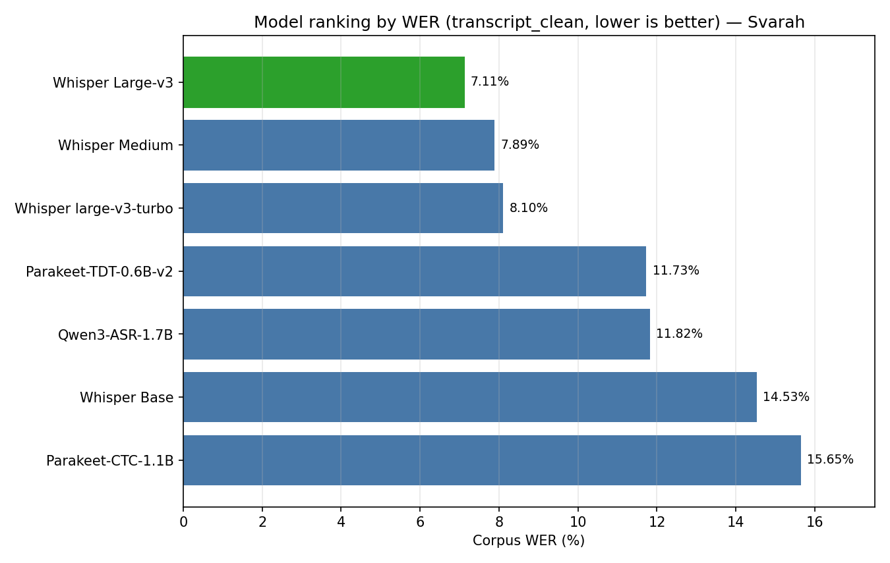
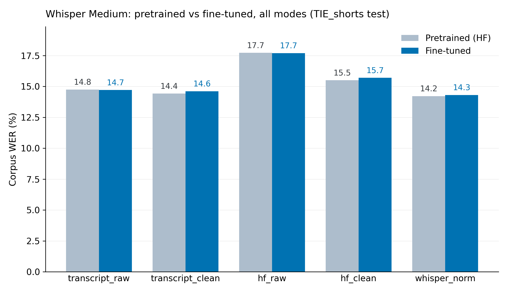

<h1 align="center">Indian-ASR-Bench</h1>

<p align="center">
  
  
  
  
  <a href="https://huggingface.co/datasets/raianand/TIE_shorts">
    
  </a>
  <a href="https://huggingface.co/datasets/ai4bharat/Svarah">
    
  </a>
  <a href="https://huggingface.co/theshivam7/whisper-tiny-indian-english">
    
  </a>
  <a href="https://huggingface.co/theshivam7/whisper-small-indian-english">
    
  </a>
  <a href="https://huggingface.co/theshivam7/whisper-medium-indian-english">
    
  </a>
</p>

<p align="center">
  <b>A reproducible Word Error Rate benchmark for ASR on Indian English speech:<br>
  two datasets, nine models each, up to five normalization modes, and a fine-tuning capacity study across model sizes.</b>
</p>

<p align="center">
  <a href="#pipeline">Pipeline</a> &nbsp;·&nbsp;
  <a href="#models">Models</a> &nbsp;·&nbsp;
  <a href="#datasets">Datasets</a> &nbsp;·&nbsp;
  <a href="#results-tie_shorts">Results</a> &nbsp;·&nbsp;
  <a href="#fine-tuning-pretrained-vs-fine-tuned-across-sizes">Fine-tuning</a> &nbsp;·&nbsp;
  <a href="#normalization">Normalization</a> &nbsp;·&nbsp;
  <a href="#error-analysis">Error&nbsp;Analysis</a> &nbsp;·&nbsp;
  <a href="#reproducing-results">Reproduce</a> &nbsp;·&nbsp;
  <a href="#limitations">Limitations</a>
</p>

---

## Motivation

ASR benchmarks are dominated by American and British English. Indian English, spoken by over a billion people with distinct phonology, regional accents, and code-switching, is under-evaluated, and academic lectures (rapid speech, technical vocabulary, heavy male-speaker skew) are an especially hard and practically important slice.

This project does four things:

1. It benchmarks **nine pretrained ASR systems, symmetrically, on both datasets**: [TIE_shorts](https://huggingface.co/datasets/raianand/TIE_shorts) (986 NPTEL-style lecture clips, "found" YouTube data) and [Svarah](https://huggingface.co/datasets/ai4bharat/Svarah) (6,656 curated read-speech clips), across normalization modes (five on TIE, three on Svarah — it has no alternate dataset-provided reference) and every demographic/acoustic breakdown.
2. It fine-tunes Whisper across three sizes (Tiny 39M, Small 244M, Medium 769M) on the same in-domain TIE data and compares each against its own pretrained baseline through an identical decoding pipeline, to test whether a null fine-tuning result at one size reflects a capacity ceiling or a dataset limitation (see [Fine-tuning](#fine-tuning-pretrained-vs-fine-tuned-across-sizes)).
3. It digs into the failure modes with a full-corpus, multi-model consensus artifact classifier, not just a hand-reviewed tail. Reference artifacts turn out to be rare in both corpora (TIE 1.2%, Svarah 0.8% of classifiable clips) but dominate TIE's worst-WER tail (65.5%), while Svarah's tail is dominated instead by an isolated-word subtask (23% of its clips have <4-word references) where WER is quantized and the classifier is undefined. See [Error Analysis](#error-analysis).
4. And it checks that classifier against actual human judgment with a blind, stratified annotation protocol, rather than just trusting an unvalidated heuristic (see [`analysis/validation/PROTOCOL.md`](analysis/validation/PROTOCOL.md)).

Two recurring themes: **how you normalize text moves WER as much as which model you pick**, and **the median clip is 3–4 pp better than the corpus WER** because a rare-but-severe tail (reference artifacts on TIE; sub-second isolated-word items on Svarah) inflates the average.

---

## Pipeline

The benchmark is a **generalized multi-dataset framework**: one pipeline, driven by a central registry, that runs identically on any dataset. Only dataset *loading* is dataset-specific; everything after Stage 1 is dataset-agnostic.


| Step | What it does | Runs on |
|---|---|---|
| Registry | `utils/registry.py` — every model, dataset, mode, display name and colour. Single source of truth; nothing is defined anywhere else. | — |
| Stage 1 — Transcribe | Engine driver runs each model on a dataset's eval split → `results/<dataset>/stage1_raw_transcripts/wer_<model>_raw.csv`. Committed and immutable — the reproducibility anchor. | GPU |
| Stage 2 — Score | `normalize_and_score.py --dataset X` → WER/CER per mode → `results/<dataset>/stage2_processed/` | CPU |
| Stage 3 — Analyze | `compare_all` / `statistics` / `error_analysis` / `entity_analysis` → `results/<dataset>/analysis/` | CPU |
| Figures | Publication figures in the local `paper/` workspace (not shipped) | CPU |

Any normalization or metric change re-runs Stage 2/3 straight from the committed Stage 1 transcripts — no re-inference needed. `utils/datasets.py` is the dataset adapter: it validates a dataset's declared columns actually exist, catching provisional schemas early.

**Add a dataset** → append one `DatasetSpec` to `utils/registry.py` (HF id, column map, subgroup dims, applicable modes). No other file changes.
**Add a model** → append one `ModelSpec` (engine, checkpoint id, arch class, colour) and run its engine driver with `--model`.
**Add a metric** → add it in `utils/wer_compute.py` and surface it in `normalize_and_score.py` / the analysis scripts.

---

## Models

| Model | Parameters | Architecture | Reference |
|-------|:----------:|:------------:|-----------|
| **Whisper Tiny** | 39M | Encoder-Decoder | [openai/whisper-tiny](https://huggingface.co/openai/whisper-tiny) |
| **Whisper Base** | 74M | Encoder-Decoder | [openai/whisper-base](https://huggingface.co/openai/whisper-base) |
| **Whisper Small** | 244M | Encoder-Decoder | [openai/whisper-small](https://huggingface.co/openai/whisper-small) |
| **Whisper Medium** | 769M | Encoder-Decoder | [openai/whisper-medium](https://huggingface.co/openai/whisper-medium) |
| **Whisper Large-v3** | ~1.5B | Encoder-Decoder | [openai/whisper-large-v3](https://huggingface.co/openai/whisper-large-v3) |
| **Whisper large-v3-turbo** | 809M | Encoder-Decoder | [openai/whisper-large-v3-turbo](https://huggingface.co/openai/whisper-large-v3-turbo) |
| **Parakeet-TDT-0.6B-v2** | 600M | CTC + TDT | [nvidia/parakeet-tdt-0.6b-v2](https://huggingface.co/nvidia/parakeet-tdt-0.6b-v2) |
| **Parakeet-CTC-1.1B** | 1.1B | CTC | [nvidia/parakeet-ctc-1.1b](https://huggingface.co/nvidia/parakeet-ctc-1.1b) |
| **Qwen3-ASR-1.7B** | 1.7B | LLM-based | [Qwen/Qwen3-ASR-1.7B](https://huggingface.co/Qwen/Qwen3-ASR-1.7B) |
| **Whisper Tiny (fine-tuned)** | 39M | Encoder-Decoder | [theshivam7/whisper-tiny-indian-english](https://huggingface.co/theshivam7/whisper-tiny-indian-english) (*this project*) |
| **Whisper Small (fine-tuned)** | 244M | Encoder-Decoder | [theshivam7/whisper-small-indian-english](https://huggingface.co/theshivam7/whisper-small-indian-english) (*this project*) |
| **Whisper Medium (fine-tuned)** | 769M | Encoder-Decoder | [theshivam7/whisper-medium-indian-english](https://huggingface.co/theshivam7/whisper-medium-indian-english) (*this project*) |

All nine pretrained models are evaluated as-is, on **both** datasets — this is the headline benchmark. (Whisper Tiny/Small and large-v3-turbo/Parakeet-CTC were added on a rolling basis during the study; every model now has full coverage on both TIE_shorts and Svarah.) Fine-tuning is TIE-only and analyzed separately in [Fine-tuning](#fine-tuning-pretrained-vs-fine-tuned-across-sizes); all three fine-tuned checkpoints are published to the HF Hub.

---

## Datasets

**[raianand/TIE_shorts](https://huggingface.co/datasets/raianand/TIE_shorts)**: NPTEL-style academic lecture audio scraped from YouTube ("found" data, no controlled recording protocol).

| Dataset | Split | Clips | Duration | Mean / clip | Median / clip |
|---------|:-----:|------:|:--------:|:-----------:|:--------------:|
| TIE_shorts | train | 7,200 (filtered from 7,884 raw) | 46.9h | — | — |
| TIE_shorts | validation | 986 | 6.84h | 24.98s | 24.62s |
| TIE_shorts | **test (eval, scored)** | 986 (985 scored — 1 empty reference) | 6.72h | 24.53s | 24.20s |
| Svarah | **test (eval-only, scored)** | 6,656 | 9.61h | 5.20s | 4.21s |

TIE's `test` split is the benchmark's eval set throughout this README; `train`/`validation` are used only for fine-tuning. Svarah has no train/validation split (read-speech, eval-only; not used for fine-tuning).

**TIE_shorts test-split demographics:**

| Attribute | Distribution |
|-----------|-------------|
| Gender | Male 94.1% (927), Female 5.9% (58) |
| Speech rate | FAST 41.9% (413), SLOW 37.9% (373), AVG 20.2% (199) |
| Region | SOUTH 36.8% (362), EAST 35.7% (352), NORTH 20.5% (202), WEST 7.0% (69) |
| Discipline | Engineering 70.2% (691), Non-Engineering 29.8% (294) |

**[ai4bharat/Svarah](https://huggingface.co/datasets/ai4bharat/Svarah)**: read-speech prompts recorded under a controlled protocol across Indian speakers ("curated" data, the counterpoint to TIE's "found" data).

| Attribute | Distribution |
|-----------|-------------|
| Gender | Female 53.8% (3,579), Male 46.2% (3,077) |
| Age | 30–45 40.1% (2,670), 18–30 33.3% (2,219), 45–60 19.6% (1,305), 60+ 6.9% (462) |
| Native language | 19 native languages represented (Assamese, Bengali, Bodo, Gujarati, Hindi, Kannada, Kashmiri, Konkani, Maithili, Malayalam, and more); speakers from 65 districts per the [dataset paper](https://arxiv.org/abs/2305.15760) |

---

## Results: TIE_shorts

All numbers are corpus/per-sample WER on the `test` split under **`transcript_clean`** (the gold-standard mode: forward normalization applied symmetrically to reference and hypothesis; see [Normalization](#normalization)). Regenerated directly from `results/`.

#### Primary metric: `transcript_clean`

| Model | Corpus WER | Mean WER | Median WER | Std Dev | P90 | P95 |
|-------|:----------:|:--------:|:----------:|:-------:|:---:|:---:|
| **Whisper Medium** | **14.76%** | **15.45%** | **11.11%** | **15.90%** | **31.58%** | 39.62% |
| Parakeet-TDT-0.6B-v2 | 15.60% | 16.75% | 11.86% | 17.47% | 34.38% | 44.12% |
| Whisper Large-v3 | 15.93% | 16.88% | 11.43% | 19.20% | 35.21% | 48.94% |
| Whisper Small | 16.05% | 16.90% | 12.20% | 17.78% | 34.38% | 46.00% |
| Parakeet-CTC-1.1B | 16.45% | 17.23% | 12.90% | 15.95% | 34.69% | 44.19% |
| Qwen3-ASR-1.7B | 16.66% | 17.34% | 12.90% | 15.93% | 35.00% | 45.07% |
| Whisper Base | 17.53% | 18.38% | 13.51% | 16.95% | 38.16% | 50.00% |
| Whisper large-v3-turbo | 17.98% | 18.80% | 12.00% | 23.62% | 38.89% | 56.52% |
| Whisper Tiny | 19.43% | 20.49% | 16.28% | 17.41% | 40.28% | 51.76% |

Is any of this significant? We ran a speaker-clustered paired bootstrap over 280 speakers, Holm-corrected across all **36 pairs** (see [`statistics_transcript_clean.md`](results/tie/analysis/statistics_transcript_clean.md)). **23 of the 36 pairs are significant.** Whisper Medium's lead over Small (−1.29 pp) and Large (−1.17 pp) holds up — a smaller model beating a bigger one — but its edge over Parakeet-TDT (−0.84 pp) narrowly *misses* Holm significance (p<sub>Holm</sub>=0.052). The middle of the pack is statistically crowded: Small, Large, Parakeet-TDT, Parakeet-CTC, and Qwen3 form a mutually-indistinguishable cluster in most pairings, and even Whisper Base is statistically tied with the much larger large-v3-turbo (diff −0.45 pp, not significant) — model size alone doesn't predict the ranking here.

> The **fine-tuned** models are not in this ranking because they run through a different decoder (HuggingFace `transformers`, not `openai-whisper`); mixing them in here would confound fine-tuning with a decoding-engine change. Their fair, engine-controlled comparison is in [Fine-tuning](#fine-tuning-pretrained-vs-fine-tuned-across-sizes).

<p align="center">
  
</p>

#### Key findings

1. **Whisper Medium wins overall** at 14.76% corpus WER, and it's also among the most consistent models here (lowest Std Dev, lowest median WER).
2. Parakeet-TDT-0.6B (15.60%) edges out Whisper Large-v3 (15.93%), though the gap isn't statistically significant — a 600M specialized model holding its own against a ~1.5B general-purpose one.
3. **WER falls roughly with Whisper capacity** (Tiny 19.43% → Base 17.53% → Small 16.05% → Medium 14.76%) but reverses at Large-v3 (15.93%) and large-v3-turbo (17.98%, the *worst* Whisper checkpoint besides Tiny/Base) — bigger isn't better here. See [Fine-tuning](#fine-tuning-pretrained-vs-fine-tuned-across-sizes) for what this capacity curve implies about fine-tuning gains.
4. Whisper large-v3-turbo is the *least* stable model of the whole family (Std Dev 23.62%, the highest here) despite being a distilled variant of Large-v3 — it hallucinates on the hardest clips more than any other model.
5. Normalization and reference choice alone move WER by roughly 2–3 pp, about as much as the gap between the best and worst mid-tier models (details in [Normalization](#normalization)).

The five breakdowns below use the **top 5 models by overall corpus WER** (Medium, Parakeet-TDT, Large-v3, Small, Parakeet-CTC — see the [primary metric table](#primary-metric-transcript_clean) above for the full 9-model ranking).

#### Breakdown by speech rate

| Speech Rate | Medium | Parakeet-TDT | Large-v3 | Small | Parakeet-CTC | Samples |
|:-----------:|:------:|:-------------:|:--------:|:-----:|:------------:|:-------:|
| FAST | **13.54%** | 14.38% | 13.85% | 14.53% | 15.44% | 413 |
| AVG | **13.41%** | 13.95% | 16.01% | 14.80% | 15.38% | 199 |
| SLOW | **17.24%** | 18.25% | 18.72% | 18.88% | 18.47% | 373 |

#### Breakdown by region

| Region | Medium | Parakeet-TDT | Large-v3 | Small | Parakeet-CTC | Samples |
|:------:|:------:|:-------------:|:--------:|:-----:|:------------:|:-------:|
| EAST | **13.95%** | 15.44% | 16.95% | 15.71% | 15.99% | 352 |
| NORTH | **14.74%** | 16.06% | 15.10% | 16.22% | 16.61% | 202 |
| SOUTH | **15.34%** | 15.64% | 15.67% | 16.03% | 16.86% | 362 |
| WEST | 15.47% | **14.86%** | 15.06% | 17.22% | 15.97% | 69 |

#### Breakdown by audio duration

| Duration | Medium | Parakeet-TDT | Large-v3 | Small | Parakeet-CTC |
|:--------:|:------:|:-------------:|:--------:|:-----:|:------------:|
| 0–5s | **25.00%** | 40.00% | **25.00%** | **25.00%** | 30.00% |
| 5–15s | **21.61%** | 23.91% | 25.28% | 22.46% | 25.36% |
| **15–30s** | **13.82%** | 14.96% | 14.77% | 14.90% | 15.79% |
| 30–60s | 19.83% | **18.93%** | 22.35% | 22.60% | 19.83% |
| **60s+** | 37.31% | **18.35%** | 38.23% | 45.87% | 20.18% |

Both Parakeet variants are far more robust on 60s+ clips than any Whisper size: Whisper hallucinates during long pauses, while the TDT/CTC decoders do not. (The extreme buckets are tiny: n=4 for 0–5s, n=5 for 60s+, so a single clip moves them by 20+ pp; 87% of clips sit in 15–30s. Read the extremes qualitatively.)

#### Breakdown by gender

| Gender | Medium | Parakeet-TDT | Large-v3 | Small | Parakeet-CTC | Samples |
|:------:|:------:|:-------------:|:--------:|:-----:|:------------:|:-------:|
| Female | 12.05% | **11.78%** | 12.46% | 13.99% | 12.02% | 58 |
| Male | **14.92%** | 15.83% | 16.14% | 16.18% | 16.71% | 927 |

#### Breakdown by discipline

| Discipline | Medium | Parakeet-TDT | Large-v3 | Small | Parakeet-CTC | Samples |
|:----------:|:------:|:-------------:|:--------:|:-----:|:------------:|:-------:|
| Engineering | **15.09%** | 16.30% | 16.06% | 16.36% | 16.89% | 691 |
| Non-Engineering | 13.99% | **13.95%** | 15.64% | 15.35% | 15.41% | 294 |

#### YouTube captions (archived reference)

YouTube auto-captions, evaluated on the 190 clips (19.3%) with available English captions via clip-aligned Jaccard matching, score **51.88% WER**: 3.8× worse than Whisper Medium on the same clips (13.67%). Not directly comparable to the main benchmark; kept for reference in [`archived_tasks/youtube_captions/`](archived_tasks/youtube_captions/).

---

## Results: Svarah

Svarah has no `Normalised_Transcript` field (unlike TIE), so only three modes apply: `transcript_raw`, `transcript_clean` (gold), `whisper_norm`. All nine models were run.

#### Primary metric: `transcript_clean`

| Model | Corpus WER | Mean WER | Median WER | Std Dev | P90 | P95 |
|-------|:----------:|:--------:|:----------:|:-------:|:---:|:---:|
| **Whisper Large-v3** | **7.11%** | 11.68% | 0.00% | **32.27%** | 28.57% | **71.43%** |
| Whisper Medium | 7.89% | 13.59% | 0.00% | 45.49% | 33.33% | 100.00% |
| Whisper large-v3-turbo | 8.10% | 13.45% | 0.00% | 63.13% | 33.33% | 100.00% |
| Whisper Small | 10.06% | 17.33% | 0.00% | 93.53% | 37.50% | 100.00% |
| Parakeet-TDT-0.6B-v2 | 11.73% | 17.26% | 2.63% | 35.42% | 50.00% | 100.00% |
| Qwen3-ASR-1.7B | 11.82% | 13.35% | 0.00% | 30.98% | 40.00% | 66.67% |
| Whisper Base | 14.53% | 25.36% | 6.67% | 84.42% | 64.29% | 100.00% |
| Parakeet-CTC-1.1B | 15.65% | 21.80% | 6.67% | 40.95% | 66.67% | 100.00% |
| Whisper Tiny | 19.96% | 34.95% | 11.11% | 212.89% | 83.33% | 100.00% |

Median WER hits 0.00% for six of nine models — Svarah has many short, easy read-speech prompts a good model gets exactly right, so the median is a poor summary here; corpus WER (word-count-weighted) is the more informative headline. Std Dev is dramatically higher than on TIE (Tiny's is 212.89%, vs 17.41% on TIE) — driven by Svarah's 23%-of-corpus isolated-word items, where a single wrong word can produce WER far above 100%; see [Error Analysis](#error-analysis).

#### By normalization mode

| Model | `transcript_raw` | `transcript_clean` (gold) | `whisper_norm` |
|-------|:---:|:---:|:---:|
| **Whisper Large-v3** | 7.49% | **7.11%** | 6.80% |
| Whisper Medium | 8.18% | 7.89% | 7.69% |
| Whisper large-v3-turbo | 8.32% | 8.10% | 7.76% |
| Whisper Small | 10.40% | 10.06% | 9.91% |
| Parakeet-TDT-0.6B-v2 | 13.03% | 11.73% | 8.35% |
| Qwen3-ASR-1.7B | 13.48% | 11.82% | 8.32% |
| Whisper Base | 14.88% | 14.53% | 14.37% |
| Parakeet-CTC-1.1B | 17.71% | 15.65% | 11.18% |
| Whisper Tiny | 20.33% | 19.96% | 19.52% |

Same check on Svarah, this time recording-clustered rather than speaker-clustered (the public release doesn't expose speaker IDs, so the recording tag embedded in each filename is the strictest unit available): paired bootstrap over 3,232 recordings, Holm-corrected across all **36 pairs** (see [`statistics_transcript_clean.md`](results/svarah/analysis/statistics_transcript_clean.md)). **34 of the 36 pairwise differences are significant.** The two that aren't: Whisper Medium vs. large-v3-turbo (−0.21 pp), and Parakeet-TDT vs. Qwen3 (−0.09 pp) — everywhere else, including every Tiny/Small comparison, the ranking is statistically solid.

<p align="center">
  
</p>

**Key findings:**

1. Whisper Large-v3 takes the top spot on Svarah at 7.11%, roughly half TIE's error rate for the same checkpoint (15.93%). That gap makes sense: Svarah is controlled read speech, while TIE is noisier scraped lecture audio.
2. Normalization matters a lot more here than it did on TIE, at least for the CTC/TDT/LLM models. Parakeet-TDT drops from 13.03% (`raw`) to 8.35% (`whisper_norm`), a 4.7pp swing. Why: Parakeet and Qwen3 transcribe fillers verbatim ("and uh", "mm hmm") on Svarah's spontaneous portions and spell digits differently on its read prompts. `transcript_clean` penalizes that faithful transcription, while `whisper_norm` strips the fillers and unifies numerals. Whisper models omit fillers by training anyway, so they barely move (7.89% → 7.69%).
3. The curated dataset really is cleaner than TIE, but only once you fix the classifier first. Among classifiable clips (references ≥4 words), Svarah's artifact share is 0.8% against TIE's 1.2%. Run the same classifier naively, though, and it reports 4.8% on Svarah: that's an artifact of the instrument, not the data. 23% of Svarah's clips are 1–2-word isolated-word items ("cat", "jump", sub-second audio), and any single missed word saturates recall and auto-flags the clip. On those flagged short clips the models actually disagree with each other (inter-hypothesis distance 0.92) rather than agreeing with each other and disagreeing with the reference, which is the opposite of what a true reference fault looks like: it's the signature of genuinely hard, decontextualized words ("tree"→"three", "left"→"lift"). The lesson: heuristic artifact detectors don't transfer across dataset designs unless you audit them first.

---

## Fine-tuning: pretrained vs. fine-tuned, across sizes

The Medium fine-tune (the strongest pretrained model here) came back with **no significant
gain** on the official TIE split. That raises a natural question: is Medium (769M) already
saturated by what 46.9h of TIE data can teach it (a **capacity ceiling**), or can the dataset
not support a fine-tuning gain at *any* model size? To find out, we ran the same protocol —
one official-split fine-tune, evaluated against its own pretrained baseline through an
identical decoding pipeline — on Whisper Tiny (39M) and Small (244M) as well.

**Setup:** Medium uses a full fine-tune (all 769M params) via `transformers` `Seq2SeqTrainer`
— bf16, epoch-based, early stopping on validation WER
([`finetune_medium.py`](finetune/finetune_medium.py)). Tiny/Small use an adaptation of a
step-based recipe (`max_steps=2000`, effective batch 32, fp16, best-checkpoint selection)
([`finetune_tiny_small.py`](finetune/finetune_tiny_small.py)) — a disclosed recipe
difference, not a bug; see the linked findings report for the full list of deltas. All three
compare fine-tuned vs. pretrained **decoded through the identical HF pipeline**, so the
comparison isolates fine-tuning from any decoding-engine effect.

Engine-controlled, `transcript_clean`, paired speaker-clustered bootstrap over 280 speakers,
Holm-corrected across this 3-test family (kept separate from the pretrained-model families in
[Results](#results-tie_shorts) — those cover pretrained models only, and mixing in a different decoding
engine would confound fine-tuning with an engine change):

| Size | Params | Pretrained (HF) | Fine-tuned | Δ (paired) | 95% CI | p (Holm) |
|------|:------:|:---:|:---:|:---:|:---:|:---:|
| Whisper Tiny | 39M | 22.10% | 19.14% | **−2.96 pp** | [−6.35, +0.13] | 0.195 |
| Whisper Small | 244M | 17.38% | 16.21% | **−1.17 pp** | [−3.97, +1.21] | 0.774 |
| Whisper Medium | 769M | 14.42% | 14.61% | +0.20 pp | [−0.46, +1.03] | 0.774 |

**A capacity gradient, but not (yet) a significant one.** The point estimates trace exactly
the shape the capacity-ceiling hypothesis predicts — gain shrinks monotonically as capacity
grows, flipping to null at 769M — but none of the three deltas survives Holm correction at
985 test clips; the study is underpowered to confirm a ~3 pp effect at that sample size alone.

**Read past the headline number.** For both sizes, more individual clips got *worse* after
fine-tuning than got better (Tiny: 313 improved vs. 326 regressed; Small: 263 vs. 403). The
net corpus-level gain is driven largely by fine-tuning fixing a handful of severe
repetition-loop decoding failures — one Tiny sample dropped from 977.8% WER to 55.6% — not a
broad, uniform content-adaptation improvement; fine-tuning also *introduces* the same
pathology elsewhere (one Small sample went from 66.2% to 445.1%). Both training runs showed a
healthy learn-then-overfit trajectory (Tiny best checkpoint at step 600/2000, Small at
step 800/2000), which rules out a degenerate no-learning explanation.

**Why absolute WER stays elevated (14–22%) even after fine-tuning:** mostly a domain-difficulty
floor, not a fine-tuning shortfall. TIE is noisy, scraped lecture audio — Whisper Large-v3 scores
15.93% on TIE vs. **7.11% on the controlled-protocol Svarah benchmark**, literally half — and
that gap holds for every model regardless of fine-tuning.

> ⚠️ **Speaker overlap (disclosed).** TIE's official splits share speakers: **100% of test
> speakers, and 100% of test clips, come from speakers also seen in training**
> ([`speaker_overlap.md`](results/tie/analysis/speaker_overlap.md), via
> [`check_speaker_overlap.py`](finetune/check_speaker_overlap.py)). There is
> **no clip-level leakage**, but the comparison is *speaker-matched*, so any gain above partly
> reflects speaker adaptation rather than purely accent/content adaptation.

> **Long-clip decoding note.** On 60s+ clips the HF chunked pipeline scores much higher WER
> than the same weights under `openai-whisper` (long-form chunk stitching) — a decoding-pipeline
> artifact, not a fine-tuning effect. It hits pretrained and fine-tuned equally, so the
> head-to-head above stays fair, but it does inflate Std Dev/tail metrics for HF-pipeline runs.

**Bottom line:** directionally supportive of the capacity-ceiling explanation for Medium's
null result, but not conclusive on its own — 985 test clips is not enough to statistically
confirm a ~3pp effect after correcting for three comparisons, and part of the observed gain is
decoding-pathology-fixing rather than uniform improvement. Full methodology, training
trajectories, and per-sample breakdowns:
[`findings_tiny_small_ft.md`](results/tie/analysis/findings_tiny_small_ft.md),
[`finetune_comparison.md`](results/tie/analysis/finetune_comparison.md) (Medium),
[`finetune_comparison_small.md`](results/tie/analysis/finetune_comparison_small.md),
[`finetune_comparison_tiny.md`](results/tie/analysis/finetune_comparison_tiny.md).

<p align="center">
  
</p>

---

## Normalization

Every WER number above depends on how text gets normalized before comparison — normalization alone moves WER by 2–4 pp, comparable to the gap between mid-tier models, so this is documented precisely rather than as an implementation detail.

Three normalizers do all the work (`utils/normalize.py`):

| Normalizer | What it does | Used by |
|---|---|---|
| `minimal_clean_text` | Strip wrapping quotes, lowercase, remove punctuation. No number/possessive handling. | `*_raw` modes |
| `normalize_text` | Unicode NFC → fix possessives (`"Bernoulli's"` → `"bernoulli s"`) → ordinals/cardinals to words (`"1st"` → `"first"`, `"100"` → `"one hundred"`) → lowercase → strip punctuation → collapse whitespace. Contractions are intentionally **left unexpanded** (`"don't"` → `"dont"`, applied to both sides) so the metric doesn't reward a rewrite neither transcript uses. | `*_clean` modes (**gold standard**) |
| `whisper_normalize_text` | OpenAI's community `EnglishTextNormalizer` — the widely-used reference implementation, which *does* expand contractions (`"don't"` → `"do not"`). | `whisper_norm` mode |

All normalization is applied **symmetrically** to reference and hypothesis. Which of the five modes apply depends on the dataset's schema (TIE has both a gold reference and a dataset-provided alternate reference, so all five apply; Svarah has only a gold reference, so only `transcript_raw`/`transcript_clean`/`whisper_norm` apply):

| Mode | Reference | Normalizer | Purpose |
|------|-----------|:-------------:|---------|
| `transcript_raw` | gold (`Transcript` / `text`) | `minimal_clean_text` | Near-upper-bound baseline |
| `transcript_clean` | gold (`Transcript` / `text`) | `normalize_text` | **Gold standard, primary metric** |
| `whisper_norm` | gold (`Transcript` / `text`) | `whisper_normalize_text` | Cross-checks the primary metric against a widely-used reference normalizer |
| `hf_raw` | `Normalised_Transcript` (TIE only) | `minimal_clean_text` | Quantifies dataset normalization errors |
| `hf_clean` | `Normalised_Transcript` (TIE only) | `normalize_text` | Dataset norm + our fix |

**Why the dataset's `Normalised_Transcript` is unreliable — concrete example (TIE, corpus WER):**

| Mode | Base | Medium | Large-v3 | Parakeet | Qwen3 |
|------|:----:|:------:|:--------:|:--------:|:-----:|
| `transcript_raw` (minimal cleanup) | 17.91% | 15.11% | 16.31% | 15.97% | 18.15% |
| `transcript_clean` (**gold standard**) | 17.53% | **14.76%** | 15.93% | 15.60% | 16.66% |
| `hf_raw` (dataset's normalization, broken) | 20.24% | 18.01% | 19.14% | 18.54% | 17.99% |
| `hf_clean` (dataset norm + our fix) | 18.07% | 15.76% | 16.94% | 16.40% | 17.61% |

`Normalised_Transcript` maps `"the 1st component"` → `"the one s t component"` (ordinal split into characters), affecting 50+ clips and inflating `hf_raw` WER by **2.7–3.3 pp** for the seven Whisper/Parakeet-TDT systems, compared to the gold `transcript_clean`. The two most *verbatim* systems are the exceptions — Qwen3 (+1.3 pp) and Parakeet-CTC (+0.7 pp; raw-vs-raw its sign even flips, 17.15% `hf_raw` vs 18.53% `transcript_raw`): their punctuation-rich literal output happens to agree better with the mangled normalized reference. Reference faults are style-dependent, so they can't be differenced out across models. **Always use `transcript_clean`.**

**Metrics** (`utils/wer_compute.py`): WER and CER both use the standard substitutions+deletions+insertions over the reference word/character count, with an empty hypothesis handled consistently as all-deletions for both metrics. Mean/median/std/P90/P95 use `statistics.mean`/`median`/`stdev` plus nearest-rank percentiles. Confidence intervals use a speaker- (TIE) or recording-clustered (Svarah) paired bootstrap (2000 resamples, seed 42) with Holm–Bonferroni correction across every pairwise family — already implemented and reported for every result above, not a Phase 2 addition.

---

## Error Analysis

Dataset artifacts (clip/reference misalignment) are classified with a **full-corpus, multi-model consensus classifier** (every clip, not just a hand-reviewed tail) using per-clip reference-word recall and hypothesis/reference length ratio, averaged across all models. Clips with **<4-word references are excluded as unclassifiable** (`short_ref`): with an *n*-word reference, recall is quantized to multiples of 1/*n* and one wrong word crosses either threshold, so the signals carry no information there. Full analysis with evidence: [`results/tie/analysis/error_analysis_transcript_clean.md`](results/tie/analysis/error_analysis_transcript_clean.md) (TIE) and [`results/svarah/analysis/error_analysis_transcript_clean.md`](results/svarah/analysis/error_analysis_transcript_clean.md) (Svarah).

**Reference artifacts are rare in both corpora; what dominates each dataset's tail differs:**

| | TIE_shorts | Svarah |
|---|:---:|:---:|
| Artifact share (classifiable clips, refs ≥4 words) | **1.2%** (95% CI 0.7–2.1%) | **0.8%** (95% CI 0.6–1.1%) |
| Short-reference (<4 words) share of corpus | 0.1% (1 clip) | **23.0%** (1,530 clips) |
| Worst-20-per-model tail: artifacts | **65.5%** (55 tail clips) | 3.3% (122 tail clips) |
| Per-model WER inflation from artifacts | ≈0.55–0.75 pp | ≈0.31–0.39 pp |

The original hand-analysis figure, ~70% of the worst-20 samples being dataset artifacts, still holds up as TIE's tail statistic. It was never wrong; it's just wrong to report it as if it applied to the whole corpus. On Svarah the curated dataset really is cleaner (0.8% vs 1.2%), but run the same classifier without care and it reports 4.8%. That's an instrument artifact, not a data artifact: Svarah's isolated-word items (sub-second clips like "cat", "jump") auto-flag on any single-word miss, yet on those clips the models disagree with each other (inter-hypothesis distance 0.92 vs 0.17–0.23 on TIE's true artifacts), which is the signature of genuinely hard decontextualized words, not reference faults. It's a fitting demonstration of the project's whole thesis, applied to its own instrument: an artifact classifier tuned on one dataset design doesn't transfer to another unless you audit it first.

**Two independent lines of evidence that TIE's flagged clips are reference errors, not model errors:**

1. **Clip over-run**: the model transcribes the reference correctly **plus** real speech the clip cut off. Proof: a CTC model (Parakeet, which structurally cannot hallucinate), an LLM (Qwen3), and Whisper all emit the *same* extra words on these clips, real audio the reference omitted, not a hallucination. Example (TIE, `-2aOCNaOiLs`): REF "considered in problem forty five" → every model outputs "…forty five **let us do that**" (80% WER, model perfect).
2. **Inter-hypothesis agreement**: on flagged clips, models agree with *each other* (mean pairwise hypothesis distance ≈0.11–0.23) far more than they agree with the reference (≈0.87–1.0 WER against it), architecture-independent evidence the fault is in the reference, since these models share no decoder or training objective.

On Svarah the same check is applied honestly in reverse: its `clip_over_run` flags show the agree-with-each-other signature (inter-hyp distance 0.17), but its residual `content_mismatch` flags do **not** (0.79), so Svarah's true reference-fault rate is, if anything, *below* the 0.8% headline. The agreement check acts as a built-in audit on the classifier itself.

**Other patterns (TIE, evidence in the doc):**

- SLOW speech dominates the tail: 38% of the data but the majority of the high-WER clips. This comes from truncated reference windows on slow, self-correcting delivery, not from worse acoustics.
- Errors are U-shaped by duration: over-represented at 0–5s and 60s+, under-represented in the safe 15–30s middle.
- Hallucination is the biggest genuine failure mode. Whisper large-v3-turbo now has the highest Std Dev of any model (23.62%), consistent with it hallucinating on the hardest clips more than the rest of the family.
- No female speaker shows up in any model's top-20 worst clips. The sample is small, but the pattern is consistent across models.

**Implication:** median WER (11.1% for Medium on TIE) is a more honest estimate of typical quality than corpus WER (14.8%); the ~3.5 pp gap is this rare-but-severe tail. Model *rankings* are essentially unaffected (all models hit the same artifacts equally); only the absolute numbers are inflated by a consistent ≈0.6 pp on TIE (≈0.35 pp on Svarah).

**Classifier validation:** the consensus classifier above is a heuristic, not ground truth. A blind, stratified human-annotation protocol (annotators see only the audio and reference, never the model output or predicted label) is implemented in [`analysis/validation/`](analysis/validation/) to measure its precision/recall against human judgment. See [`PROTOCOL.md`](analysis/validation/PROTOCOL.md) for the methodology; results pending the annotation pass.

---

## Reproducing Results

Every Stage-1 run writes a `wer_<model>_manifest.json` beside its raw CSV recording the
model + pinned dataset revision, decode parameters, package versions, git commit, and host.
Decode settings and known nondeterminism are documented in
[`docs/DECODE_CONFIG.md`](docs/DECODE_CONFIG.md); the committed raw transcripts are the
reproducibility anchor.

**Analysis only (no GPU)**: recompute every table + figure from the committed transcripts:

```bash
git clone https://github.com/theshivam7/indian-asr-bench && cd indian-asr-bench
pip install -r requirements.txt
python normalize_and_score.py --dataset tie      # Stage 2 → results/tie/stage2_processed/
python analysis/compare_all.py --dataset tie     # Stage 3 tables + charts
python analysis/statistics.py --dataset tie      # cluster-bootstrap CIs + Holm-corrected paired tests
python analysis/error_analysis.py --dataset tie  # codified artifact taxonomy (+ instrument audit)
python analysis/compare_finetune.py              # fine-tuning report (TIE)
```

(Repeat with `--dataset svarah` for the second corpus. The publication-figure script lives in the local paper workspace and is not part of the shipped pipeline; every table and chart above regenerates from the committed transcripts alone.)

**Transcription (GPU)**: registry-driven drivers, `--model` / `--dataset`:

```bash
bash whisper_asr/setup.sh                                              # one env for all Whisper models
python whisper_asr/run_whisper.py --model large_v3_turbo --dataset tie # → results/tie/stage1_raw_transcripts/
python parakeet/wer_parakeet.py --model parakeet_ctc --dataset tie
python qwen3/wer_qwen3.py --dataset svarah
```

**On a cluster (NSCC / PBS Pro)**: one command submits every remaining experiment with the right parallelism and dependency chaining, printing the job IDs:

```bash
hf auth login                                           # once, Svarah is gated
PROJECT=<nscc_project_id> bash hpc/submit_all.sh        # add --setup to also create the conda envs
```

Or drive pieces individually: `qsub -P <id> -v DATASET=svarah hpc/run_pipeline.pbs` (full run), `qsub -P <id> -v DATASET=tie hpc/job_score.pbs` (CPU-only re-scoring), `qsub -P <id> -v DATASETS=tie,svarah hpc/job_figures.pbs` (combined figures). See [`hpc/README.md`](hpc/README.md).

**Fine-tuning (GPU)**: official split, per model size:

```bash
bash finetune/setup.sh
python finetune/finetune_medium.py                                    # Medium → models/whisper_medium_ft/
MODEL_NAME=medium_hf python finetune/evaluate_finetuned.py
MODEL_NAME=medium_ft python finetune/evaluate_finetuned.py

python finetune/finetune_tiny_small.py \
    --base-model openai/whisper-tiny --output-dir models/whisper_tiny_ft   # Tiny (or --base-model openai/whisper-small)
MODEL_NAME=tiny_hf python finetune/evaluate_finetuned.py
MODEL_NAME=tiny_ft MODEL_SOURCE=models/whisper_tiny_ft python finetune/evaluate_finetuned.py
```

Or on the cluster: `qsub -v SIZE=tiny hpc/job_finetune_size.pbs` (or `SIZE=small`) runs the Tiny/Small capacity-study fine-tune end to end.

Conda specs in [`environments/`](environments/); PBS jobs + the `submit_all.sh` one-shot submitter in [`hpc/`](hpc/)
(`job_whisper`, `job_parakeet`, `job_qwen3`, `job_svarah`, `job_new_models_tie`, `job_finetune`,
`job_medium_ft`, `job_finetune_size`, `job_score`, `job_figures`). All runs on a single **NVIDIA A100-40GB** (NSCC ASPIRE2A).

---

## Limitations

Stated so the numbers above are read correctly:

- The artifact classifier hasn't been validated against human judgment yet. It's backed by inter-hypothesis agreement evidence and manual reading of flagged clips, but the blind human-annotation pass still needs to run.
- Svarah can only be clustered by recording, not by speaker, since the public release doesn't expose speaker IDs. That's 3,232 recording clusters versus the 117 true speakers in the dataset paper, and true speaker clustering would widen the confidence intervals further. TIE doesn't have this problem: its clusters are real speakers.
- The fine-tuning study is single-seed per size (one official-split run each, no multi-seed replication), and none of the three size-vs-pretrained deltas survives Holm correction at 985 test clips — read the capacity gradient (Tiny > Small > Medium) as suggestive, not statistically confirmed. Per-sample analysis also shows the net gain is partly driven by fixing a handful of severe repetition-loop decoding failures rather than a uniform improvement — see [Fine-tuning](#fine-tuning-pretrained-vs-fine-tuned-across-sizes).
- Training-data contamination is possible: NPTEL lectures are public and may already appear in Whisper's web-scraped training data. A small probe (grounded vs. free-decoding agreement with flawed references) turned up no memorization signal, but with n=10 it's a low-powered check.
- Stage-1 transcripts are single runs with temperature-fallback decoding ([`docs/DECODE_CONFIG.md`](docs/DECODE_CONFIG.md)). The committed raw CSVs, not re-decoding, are the reproducibility anchor.
- Some cells are just small: duration extremes sit at n=4–5, and TIE has only 58 female speakers. Read those numbers qualitatively, not as precise estimates.

---

## Future Work

- **Run the blind human-annotation pass** ([`analysis/validation/`](analysis/validation/), 91-item stratified sheet) to turn the artifact classifier's heuristic status into measured precision/recall — the highest-value remaining task.
- **Fine-tune on natively speaker-disjoint Indian-accent data** (e.g. the Indian subset of AESRC2020) to separate accent/content adaptation from the speaker adaptation that TIE's overlapping splits cannot rule out.
- **Multi-seed replication** of the fine-tuning capacity study (currently one run per size), which would also power the study to confirm or reject the ~3 pp Tiny-size effect.
- **Activate the NEER entity metric** (`analysis/entity_analysis.py`) once a use-case register field is derived for Svarah (e.g. from `audio_filepath` naming) — entity-dense clips currently score WER far above 100% for spelling-convention reasons rather than misrecognition.
- **Long-form decoding study**: the HF chunked pipeline scores much higher WER than openai-whisper's stitched decoding on 60s+ clips with identical weights; quantifying that engine effect would de-confound several tail metrics.

---

<p align="center">
  MIT licensed — see <a href="LICENSE">LICENSE</a>. Datasets (<a href="https://huggingface.co/datasets/raianand/TIE_shorts">TIE_shorts</a>, <a href="https://huggingface.co/datasets/ai4bharat/Svarah">Svarah</a>) are under their own licenses. Contributions welcome — see <a href="CONTRIBUTING.md">CONTRIBUTING.md</a>.
</p>
