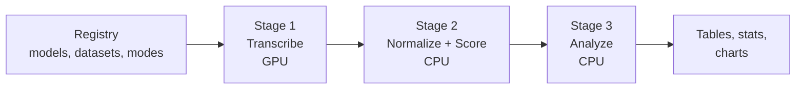

<h1 align="center">Indian-ASR-Bench</h1>

<p align="center">
  
  
  
  
  <a href="https://huggingface.co/datasets/raianand/TIE_shorts">
    
  </a>
  <a href="https://huggingface.co/datasets/ai4bharat/Svarah">
    
  </a>
  <a href="https://huggingface.co/datasets/pengyizhou/accented_english">
    
  </a>
  <a href="https://huggingface.co/theshivam7/whisper-tiny-indian-english">
    
  </a>
  <a href="https://huggingface.co/theshivam7/whisper-small-indian-english">
    
  </a>
  <a href="https://huggingface.co/theshivam7/whisper-medium-indian-english">
    
  </a>
</p>

<p align="center">
  <b>A reproducible Word Error Rate benchmark for ASR on Indian English speech:<br>
  three datasets, nine models each, up to five normalization modes, and a fine-tuning capacity study across model sizes.</b>
</p>

<p align="center">
  <a href="#pipeline">Pipeline</a> &nbsp;·&nbsp;
  <a href="#models">Models</a> &nbsp;·&nbsp;
  <a href="#datasets">Datasets</a> &nbsp;·&nbsp;
  <a href="#results-tie_shorts">Results</a> &nbsp;·&nbsp;
  <a href="#fine-tuning-pretrained-vs-fine-tuned-across-sizes">Fine-tuning</a> &nbsp;·&nbsp;
  <a href="#normalization">Normalization</a> &nbsp;·&nbsp;
  <a href="#error-analysis">Error&nbsp;Analysis</a> &nbsp;·&nbsp;
  <a href="#reproducing-results">Reproduce</a> &nbsp;·&nbsp;
  <a href="#limitations">Limitations</a>
</p>

---

## Motivation

Most ASR benchmarks focus on American and British English. Indian English is spoken by over a billion people, yet it gets far less evaluation attention. Academic lecture speech makes it harder still: fast delivery, dense technical vocabulary, and real-world recording conditions.

This project answers four questions:

| # | Question | Where |
|:-:|---|---|
| 1 | How do nine pretrained ASR systems rank on Indian English, on both a scraped corpus and a curated one? | [Results](#results-tie_shorts) |
| 2 | Does in-domain fine-tuning help, and does the answer change with model size? | [Fine-tuning](#fine-tuning-pretrained-vs-fine-tuned-across-sizes) |
| 3 | How much of the reported WER comes from the evaluation itself: reference choice, normalization, dataset artifacts? | [Normalization](#normalization) |
| 4 | Can the error-analysis instrument itself be trusted? | [Error Analysis](#error-analysis) |

Two headline findings:

- **Normalization moves WER as much as the model choice.** Switching normalizer or reference shifts scores by 2 to 4.5 pp, the size of most model-to-model gaps.
- **The median clip scores well below corpus WER.** On TIE the gap is 3 to 4 pp (reference artifacts in the tail); on Svarah it is 7 to 12 pp, since median WER is 0% for six of nine models on its many short, isolated-word prompts, while a rare severe miss inflates the corpus average.

---

## Pipeline

One registry-driven pipeline runs identically on every dataset. Only the loading step is dataset-specific.



| Step | What it does | Output |
|---|---|---|
| Registry | `utils/registry.py` defines every model, dataset, mode, and display name. Single source of truth. | - |
| Stage 1 | An engine driver transcribes a dataset's eval split. Committed and immutable: the reproducibility anchor. | `results/<dataset>/stage1_raw_transcripts/` |
| Stage 2 | `normalize_and_score.py` computes per-clip WER/CER under every normalization mode. | `results/<dataset>/stage2_processed/` |
| Stage 3 | Comparisons, cluster-bootstrap statistics, error taxonomy, fine-tuning reports, charts. | `results/<dataset>/analysis/` |

Any normalization or metric change re-runs Stages 2 and 3 from the committed transcripts. No re-inference needed.

Extending the benchmark:

- **New dataset**: add one `DatasetSpec` to the registry. No other file changes.
- **New model**: add one `ModelSpec`, then run its engine driver with `--model`.
- **New metric**: add it to `utils/wer_compute.py` and surface it in Stage 2/3.

---

## Models

| Model | Parameters | Architecture | Reference |
|-------|:----------:|:------------:|-----------|
| **Whisper Tiny** | 39M | Encoder-Decoder | [openai/whisper-tiny](https://huggingface.co/openai/whisper-tiny) |
| **Whisper Base** | 74M | Encoder-Decoder | [openai/whisper-base](https://huggingface.co/openai/whisper-base) |
| **Whisper Small** | 244M | Encoder-Decoder | [openai/whisper-small](https://huggingface.co/openai/whisper-small) |
| **Whisper Medium** | 769M | Encoder-Decoder | [openai/whisper-medium](https://huggingface.co/openai/whisper-medium) |
| **Whisper Large-v3** | ~1.5B | Encoder-Decoder | [openai/whisper-large-v3](https://huggingface.co/openai/whisper-large-v3) |
| **Whisper large-v3-turbo** | 809M | Encoder-Decoder | [openai/whisper-large-v3-turbo](https://huggingface.co/openai/whisper-large-v3-turbo) |
| **Parakeet-TDT-0.6B-v2** | 600M | CTC + TDT | [nvidia/parakeet-tdt-0.6b-v2](https://huggingface.co/nvidia/parakeet-tdt-0.6b-v2) |
| **Parakeet-CTC-1.1B** | 1.1B | CTC | [nvidia/parakeet-ctc-1.1b](https://huggingface.co/nvidia/parakeet-ctc-1.1b) |
| **Qwen3-ASR-1.7B** | 1.7B | LLM-based | [Qwen/Qwen3-ASR-1.7B](https://huggingface.co/Qwen/Qwen3-ASR-1.7B) |
| **Whisper Tiny (fine-tuned)** | 39M | Encoder-Decoder | [theshivam7/whisper-tiny-indian-english](https://huggingface.co/theshivam7/whisper-tiny-indian-english) (*this project*) |
| **Whisper Small (fine-tuned)** | 244M | Encoder-Decoder | [theshivam7/whisper-small-indian-english](https://huggingface.co/theshivam7/whisper-small-indian-english) (*this project*) |
| **Whisper Medium (fine-tuned)** | 769M | Encoder-Decoder | [theshivam7/whisper-medium-indian-english](https://huggingface.co/theshivam7/whisper-medium-indian-english) (*this project*) |

All nine pretrained models run as-is on **all three** datasets. That is the headline benchmark. Fine-tuning is analyzed separately in [Fine-tuning](#fine-tuning-pretrained-vs-fine-tuned-across-sizes): TIE's Tiny/Small/Medium capacity study is complete (checkpoints published on the HF Hub); the same study is running on AESRC's natively speaker-disjoint split, results incoming.

---

## Datasets

**[raianand/TIE_shorts](https://huggingface.co/datasets/raianand/TIE_shorts)**: academic lecture audio scraped from YouTube (NPTEL style). "Found" data, no controlled recording protocol.

**[ai4bharat/Svarah](https://huggingface.co/datasets/ai4bharat/Svarah)**: read-speech prompts recorded under a controlled protocol. "Curated" data, the counterpoint to TIE.

**[pengyizhou/accented_english](https://huggingface.co/datasets/pengyizhou/accented_english)** (AESRC2020, Indian subset): short read commands and queries from the Accented English Speech Recognition Challenge 2020 ([Shi et al., ICASSP 2021](https://arxiv.org/abs/2102.10233)). The mirror carries 8 national accents; the pipeline filters to `accent == INDIAN` on load. Its test split is natively speaker-disjoint from train (481 vs 38 speakers, zero overlap), which makes it the clean instrument for the fine-tuning capacity study. The mirror states no license, so paper use needs a data-use sign-off first.

| Dataset | Split | Clips | Duration | Mean / clip | Median / clip |
|---------|:-----:|------:|:--------:|:-----------:|:--------------:|
| TIE_shorts | train | 7,200 (filtered from 7,884 raw) | 46.9h | - | - |
| TIE_shorts | validation | 986 | 6.84h | 24.98s | 24.62s |
| TIE_shorts | **test (eval, scored)** | 986 (985 scored, 1 empty reference) | 6.72h | 24.53s | 24.20s |
| Svarah | **test (eval-only, scored)** | 6,656 | 9.61h | 5.20s | 4.21s |
| AESRC (Indian) | train | 12,820 | 17.48h | 4.91s | - |
| AESRC (Indian) | validation | 532 | 0.76h | 5.12s | - |
| AESRC (Indian) | **test (eval, scored)** | 1,731 | 2.15h | 4.47s | - |

TIE's and AESRC's `test` splits are the eval sets; `train` and `validation` are used only for fine-tuning. Svarah has no train or validation split and is eval-only.

**TIE_shorts test-split demographics:**

| Attribute | Distribution |
|-----------|-------------|
| Gender | Male 94.1% (927), Female 5.9% (58) |
| Speech rate | FAST 41.9% (413), SLOW 37.9% (373), AVG 20.2% (199) |
| Region | SOUTH 36.8% (362), EAST 35.7% (352), NORTH 20.5% (202), WEST 7.0% (69) |
| Discipline | Engineering 70.2% (691), Non-Engineering 29.8% (294) |

**Svarah test-split demographics:**

| Attribute | Distribution |
|-----------|-------------|
| Gender | Female 53.8% (3,579), Male 46.2% (3,077) |
| Age | 30–45 40.1% (2,670), 18–30 33.3% (2,219), 45–60 19.6% (1,305), 60+ 6.9% (462) |
| Native language | 19 languages (Assamese, Bengali, Bodo, Gujarati, Hindi, Kannada, and more); 65 districts per the [dataset paper](https://arxiv.org/abs/2305.15760) |

---

## Results: TIE_shorts

All numbers are WER on the `test` split under **`transcript_clean`**, the gold mode: forward normalization applied symmetrically to reference and hypothesis (see [Normalization](#normalization)).

#### Primary metric: `transcript_clean`

| Model | Corpus WER | Mean WER | Median WER | Std Dev | P90 | P95 |
|-------|:----------:|:--------:|:----------:|:-------:|:---:|:---:|
| **Whisper Medium** | **14.76%** | **15.45%** | **11.11%** | **15.90%** | **31.58%** | 39.62% |
| Parakeet-TDT-0.6B-v2 | 15.60% | 16.75% | 11.86% | 17.47% | 34.38% | 44.12% |
| Whisper Large-v3 | 15.93% | 16.88% | 11.43% | 19.20% | 35.21% | 48.94% |
| Whisper Small | 16.05% | 16.90% | 12.20% | 17.78% | 34.38% | 46.00% |
| Parakeet-CTC-1.1B | 16.45% | 17.23% | 12.90% | 15.95% | 34.69% | 44.19% |
| Qwen3-ASR-1.7B | 16.66% | 17.34% | 12.90% | 15.93% | 35.00% | 45.07% |
| Whisper Base | 17.53% | 18.38% | 13.51% | 16.95% | 38.16% | 50.00% |
| Whisper large-v3-turbo | 17.98% | 18.80% | 12.00% | 23.62% | 38.89% | 56.52% |
| Whisper Tiny | 19.43% | 20.49% | 16.28% | 17.41% | 40.28% | 51.76% |

<p align="center">
  
</p>

Statistical check: speaker-clustered paired bootstrap over 280 speakers, Holm-corrected across all 36 pairs ([full tables](results/tie/analysis/statistics_transcript_clean.md)).

- **23 of the 36 pairs are significant.**
- Whisper Medium beats Small (−1.29 pp) and Large-v3 (−1.17 pp). A smaller model wins against bigger ones.
- Medium's edge over Parakeet-TDT (−0.84 pp) narrowly misses significance (p<sub>Holm</sub>=0.052).
- Small, Large-v3, both Parakeets, and Qwen3 are mutually indistinguishable in most pairings.
- Whisper Base (74M) is statistically tied with large-v3-turbo (809M), diff −0.45 pp. Model size alone does not predict rank here.

> Fine-tuned models are excluded from this ranking because they decode through a different engine (HF `transformers` rather than `openai-whisper`). Their engine-controlled comparison is in [Fine-tuning](#fine-tuning-pretrained-vs-fine-tuned-across-sizes).

#### Cross-check: `whisper_norm`

Corpus WER under OpenAI's `EnglishTextNormalizer` instead of this project's `transcript_clean` normalizer, same gold reference. Computed for every model alongside the primary metric; shown here since it does not appear in the ranking table above.

| Model | `transcript_clean` (gold) | `whisper_norm` | Δ |
|-------|:--------------------------:|:---------------:|:-:|
| Whisper Medium | 14.76% | 14.48% | −0.28 pp |
| Parakeet-TDT-0.6B-v2 | 15.60% | 15.17% | −0.43 pp |
| Whisper Large-v3 | 15.93% | 15.76% | −0.17 pp |
| Whisper Small | 16.05% | 15.80% | −0.25 pp |
| Parakeet-CTC-1.1B | 16.45% | 16.19% | −0.26 pp |
| Qwen3-ASR-1.7B | 16.66% | 15.40% | −1.26 pp |
| Whisper Base | 17.53% | 17.03% | −0.50 pp |
| Whisper large-v3-turbo | 17.98% | 17.75% | −0.23 pp |
| Whisper Tiny | 19.43% | 19.01% | −0.42 pp |

`whisper_norm` lowers every model's WER, but unevenly: Qwen3 moves the most (−1.26 pp), rising from 6th to 3rd place and passing both Large-v3 and Small, while the Whisper family barely shifts (~0.2 to 0.5 pp). `transcript_clean` remains the primary metric throughout this README.

#### Key findings

1. **Whisper Medium wins** at 14.76% corpus WER, and it is also the most consistent model (lowest Std Dev and median).
2. Parakeet-TDT (600M, 15.60%) edges out Whisper Large-v3 (~1.5B, 15.93%), though not significantly.
3. **WER falls with Whisper capacity up to Medium** (Tiny 19.43%, Base 17.53%, Small 16.05%, Medium 14.76%), then reverses at Large-v3 and large-v3-turbo. Bigger is not better on this data.
4. large-v3-turbo is the least stable model in the study (Std Dev 23.62%, the highest). It hallucinates on hard clips more than any other model.
5. Normalization and reference choice alone move WER by 2 to 3 pp. Details in [Normalization](#normalization).

The five breakdowns below use the **top 5 models by corpus WER** (Medium, Parakeet-TDT, Large-v3, Small, Parakeet-CTC).

#### Breakdown by speech rate

| Speech Rate | Medium | Parakeet-TDT | Large-v3 | Small | Parakeet-CTC | Samples |
|:-----------:|:------:|:-------------:|:--------:|:-----:|:------------:|:-------:|
| FAST | **13.54%** | 14.38% | 13.85% | 14.53% | 15.44% | 413 |
| AVG | **13.41%** | 13.95% | 16.01% | 14.80% | 15.38% | 199 |
| SLOW | **17.24%** | 18.25% | 18.72% | 18.88% | 18.47% | 373 |

#### Breakdown by region

| Region | Medium | Parakeet-TDT | Large-v3 | Small | Parakeet-CTC | Samples |
|:------:|:------:|:-------------:|:--------:|:-----:|:------------:|:-------:|
| EAST | **13.95%** | 15.44% | 16.95% | 15.71% | 15.99% | 352 |
| NORTH | **14.74%** | 16.06% | 15.10% | 16.22% | 16.61% | 202 |
| SOUTH | **15.34%** | 15.64% | 15.67% | 16.03% | 16.86% | 362 |
| WEST | 15.47% | **14.86%** | 15.06% | 17.22% | 15.97% | 69 |

#### Breakdown by audio duration

| Duration | Medium | Parakeet-TDT | Large-v3 | Small | Parakeet-CTC |
|:--------:|:------:|:-------------:|:--------:|:-----:|:------------:|
| 0–5s | **25.00%** | 40.00% | **25.00%** | **25.00%** | 30.00% |
| 5–15s | **21.61%** | 23.91% | 25.28% | 22.46% | 25.36% |
| **15–30s** | **13.82%** | 14.96% | 14.77% | 14.90% | 15.79% |
| 30–60s | 19.83% | **18.93%** | 22.35% | 22.60% | 19.83% |
| **60s+** | 37.31% | **18.35%** | 38.23% | 45.87% | 20.18% |

Both Parakeet variants stay robust on 60s+ clips while every Whisper size degrades: Whisper hallucinates during long pauses, the TDT/CTC decoders do not. The extreme buckets are tiny (n=4 for 0–5s, n=5 for 60s+), so read them qualitatively; 87% of clips sit in 15–30s.

#### Breakdown by gender

| Gender | Medium | Parakeet-TDT | Large-v3 | Small | Parakeet-CTC | Samples |
|:------:|:------:|:-------------:|:--------:|:-----:|:------------:|:-------:|
| Female | 12.05% | **11.78%** | 12.46% | 13.99% | 12.02% | 58 |
| Male | **14.92%** | 15.83% | 16.14% | 16.18% | 16.71% | 927 |

#### Breakdown by discipline

| Discipline | Medium | Parakeet-TDT | Large-v3 | Small | Parakeet-CTC | Samples |
|:----------:|:------:|:-------------:|:--------:|:-----:|:------------:|:-------:|
| Engineering | **15.09%** | 16.30% | 16.06% | 16.36% | 16.89% | 691 |
| Non-Engineering | 13.99% | **13.95%** | 15.64% | 15.35% | 15.41% | 294 |

#### YouTube captions (archived reference)

YouTube auto-captions score **51.88% WER** on the 190 clips with available English captions, 3.8x worse than Whisper Medium on the same clips (13.67%). Not directly comparable to the main benchmark; kept in [`archived_tasks/youtube_captions/`](archived_tasks/youtube_captions/).

---

## Results: Svarah

Svarah has no alternate dataset-provided reference, so three modes apply: `transcript_raw`, `transcript_clean` (gold), and `whisper_norm`. All nine models were run.

#### Primary metric: `transcript_clean`

| Model | Corpus WER | Mean WER | Median WER | Std Dev | P90 | P95 |
|-------|:----------:|:--------:|:----------:|:-------:|:---:|:---:|
| **Whisper Large-v3** | **7.11%** | 11.68% | 0.00% | **32.27%** | 28.57% | **71.43%** |
| Whisper Medium | 7.89% | 13.59% | 0.00% | 45.49% | 33.33% | 100.00% |
| Whisper large-v3-turbo | 8.10% | 13.45% | 0.00% | 63.13% | 33.33% | 100.00% |
| Whisper Small | 10.06% | 17.33% | 0.00% | 93.53% | 37.50% | 100.00% |
| Parakeet-TDT-0.6B-v2 | 11.73% | 17.26% | 2.63% | 35.42% | 50.00% | 100.00% |
| Qwen3-ASR-1.7B | 11.82% | 13.35% | 0.00% | 30.98% | 40.00% | 66.67% |
| Whisper Base | 14.53% | 25.36% | 6.67% | 84.42% | 64.29% | 100.00% |
| Parakeet-CTC-1.1B | 15.65% | 21.80% | 6.67% | 40.95% | 66.67% | 100.00% |
| Whisper Tiny | 19.96% | 34.95% | 11.11% | 212.89% | 83.33% | 100.00% |

<p align="center">
  
</p>

Reading the distribution columns:

- Median WER is 0.00% for six of nine models. Svarah has many short read prompts that good models get exactly right, so corpus WER is the more informative headline.
- Std Dev is far higher than on TIE (Tiny: 212.89% vs 17.41%). On isolated-word items a single wrong word can score far above 100% WER. See [Error Analysis](#error-analysis).

#### By normalization mode

| Model | `transcript_raw` | `transcript_clean` (gold) | `whisper_norm` |
|-------|:---:|:---:|:---:|
| **Whisper Large-v3** | 7.49% | **7.11%** | 6.80% |
| Whisper Medium | 8.18% | 7.89% | 7.69% |
| Whisper large-v3-turbo | 8.32% | 8.10% | 7.76% |
| Whisper Small | 10.40% | 10.06% | 9.91% |
| Parakeet-TDT-0.6B-v2 | 13.03% | 11.73% | 8.35% |
| Qwen3-ASR-1.7B | 13.48% | 11.82% | 8.32% |
| Whisper Base | 14.88% | 14.53% | 14.37% |
| Parakeet-CTC-1.1B | 17.71% | 15.65% | 11.18% |
| Whisper Tiny | 20.33% | 19.96% | 19.52% |

Same check on Svarah, this time recording-clustered because the public release exposes no speaker IDs: paired bootstrap over 3,232 recording clusters, Holm-corrected across all 36 pairs ([full tables](results/svarah/analysis/statistics_transcript_clean.md)).

- **34 of the 36 pairs are significant.**
- The two that are not: Medium vs large-v3-turbo (−0.21 pp) and Parakeet-TDT vs Qwen3 (−0.09 pp). Everywhere else the ranking is statistically solid.

**Key findings:**

1. **Whisper Large-v3 wins** at 7.11%, roughly half its own TIE score (15.93%). Controlled read speech is much easier than scraped lecture audio.
2. **Normalization matters even more here.** Parakeet-TDT drops from 13.03% (raw) to 8.35% (whisper_norm), a 4.7 pp swing, and Parakeet-CTC recovers 4.5 pp. These models transcribe fillers ("and uh", "mm hmm") verbatim, and `transcript_clean` counts those as insertions while `whisper_norm` strips them. Whisper models omit fillers by training, so they barely move.
3. **Svarah really is cleaner than TIE, once the classifier is audited.** Among classifiable clips its artifact share is 0.8% against TIE's 1.2%. A naive run reports 4.8%, which is an instrument artifact: isolated-word items auto-flag on any single-word miss ("tree" heard as "three"). On those clips the models disagree with each other (inter-hypothesis distance 0.92), the opposite of a true reference fault. Full story in [Error Analysis](#error-analysis).

---

## Fine-tuning: pretrained vs. fine-tuned, across sizes

Whisper Medium fine-tuned on TIE showed no significant gain. Two explanations fit: either Medium (769M) is already saturated by what 46.9h of TIE data can teach it (a capacity ceiling), or the dataset cannot support a fine-tuning gain at any size. To decide, we ran the same protocol on Whisper Tiny (39M) and Small (244M).

**Setup:**

- Medium: full fine-tune via `transformers` `Seq2SeqTrainer`, bf16, epoch-based, early stopping on validation WER ([`finetune_medium.py`](finetune/finetune_medium.py)).
- Tiny and Small: step-based recipe, `max_steps=2000`, effective batch 32, fp16, best checkpoint by validation WER ([`finetune_tiny_small.py`](finetune/finetune_tiny_small.py)). A disclosed recipe difference, not a bug.
- Every comparison decodes fine-tuned and pretrained through the **identical HF pipeline**, so fine-tuning is isolated from engine effects.
- Paired speaker-clustered bootstrap over 280 speakers, Holm-corrected across this 3-test family, kept separate from the pretrained families above.

| Size | Params | Pretrained (HF) | Fine-tuned | Δ (paired) | 95% CI | p (Holm) |
|------|:------:|:---:|:---:|:---:|:---:|:---:|
| Whisper Tiny | 39M | 22.10% | 19.14% | **−2.96 pp** | [−6.35, +0.13] | 0.195 |
| Whisper Small | 244M | 17.38% | 16.21% | **−1.17 pp** | [−3.97, +1.21] | 0.774 |
| Whisper Medium | 769M | 14.42% | 14.61% | +0.20 pp | [−0.46, +1.03] | 0.774 |

**A capacity gradient, but not a significant one.** The point gains shrink monotonically as capacity grows, exactly the shape a capacity ceiling predicts, but no delta survives Holm correction at 985 test clips.

Read past the headline number:

- More clips got worse than better for both smaller sizes (Tiny: 313 improved vs 326 regressed; Small: 263 vs 403).
- The net gain mostly comes from fixing a few severe repetition loops. One Tiny clip fell from 977.8% to 55.6% WER. Fine-tuning also introduced the same pathology elsewhere: one Small clip rose from 66.2% to 445.1%.
- Both runs show a healthy learn-then-overfit trajectory (best checkpoints at steps 600 and 800 of 2000), which rules out a no-learning explanation.
- Absolute WER stays at 14 to 22% after fine-tuning because the domain is hard. Whisper Large-v3 scores 15.93% on TIE vs 7.11% on Svarah with identical weights.

> **Speaker overlap (disclosed).** 100% of test speakers, and 100% of test clips, come from speakers also seen in training ([`speaker_overlap.md`](results/tie/analysis/speaker_overlap.md), via [`check_speaker_overlap.py`](finetune/check_speaker_overlap.py)). There is no clip-level leakage, but the comparison is speaker-matched, so part of any gain reflects speaker adaptation rather than accent or content learning.

> **Long-clip decoding note.** On 60s+ clips the HF chunked pipeline scores much higher WER than `openai-whisper` with identical weights. This hits pretrained and fine-tuned equally, so the head-to-head stays fair, but it inflates tail metrics for HF-pipeline runs.

Full methodology and per-sample breakdowns: [`findings_tiny_small_ft.md`](results/tie/analysis/findings_tiny_small_ft.md), [`finetune_comparison.md`](results/tie/analysis/finetune_comparison.md) (Medium), [`finetune_comparison_small.md`](results/tie/analysis/finetune_comparison_small.md), [`finetune_comparison_tiny.md`](results/tie/analysis/finetune_comparison_tiny.md).

<p align="center">
  
</p>

---

## Normalization

Every WER number above depends on how text is normalized before comparison. Normalization alone moves WER by 2 to 4.5 pp, as much as the gap between mid-tier models, so it is documented precisely.

Three normalizers do all the work (`utils/normalize.py`):

| Normalizer | What it does | Used by |
|---|---|---|
| `minimal_clean_text` | Strip wrapping quotes, lowercase, remove punctuation. No number or possessive handling. | `*_raw` modes |
| `normalize_text` | Unicode NFC, possessive fix (`"Bernoulli's"` to `"bernoulli s"`), ordinals and cardinals to words (`"1st"` to `"first"`), lowercase, strip punctuation, collapse whitespace. Contractions stay unexpanded on both sides so the metric does not reward a rewrite neither transcript uses. | `*_clean` modes (**gold standard**) |
| `whisper_normalize_text` | OpenAI's `EnglishTextNormalizer`, the widely used reference implementation. It does expand contractions. | `whisper_norm` mode |

All normalization is applied **symmetrically** to reference and hypothesis. TIE has both a gold reference and a dataset-provided alternate, so five modes apply; Svarah has only a gold reference, so three:

| Mode | Reference | Normalizer | Purpose |
|------|-----------|:-------------:|---------|
| `transcript_raw` | gold (`Transcript` / `text`) | `minimal_clean_text` | Near-upper-bound baseline |
| `transcript_clean` | gold (`Transcript` / `text`) | `normalize_text` | **Gold standard, primary metric** |
| `whisper_norm` | gold (`Transcript` / `text`) | `whisper_normalize_text` | Cross-check against a widely used normalizer |
| `hf_raw` | `Normalised_Transcript` (TIE only) | `minimal_clean_text` | Quantifies dataset normalization errors |
| `hf_clean` | `Normalised_Transcript` (TIE only) | `normalize_text` | Dataset normalization plus our fix |

**Why the dataset's `Normalised_Transcript` is unreliable (TIE, corpus WER):**

| Mode | Base | Medium | Large-v3 | Parakeet | Qwen3 |
|------|:----:|:------:|:--------:|:--------:|:-----:|
| `transcript_raw` (minimal cleanup) | 17.91% | 15.11% | 16.31% | 15.97% | 18.15% |
| `transcript_clean` (**gold standard**) | 17.53% | **14.76%** | 15.93% | 15.60% | 16.66% |
| `hf_raw` (dataset's normalization, broken) | 20.24% | 18.01% | 19.14% | 18.54% | 17.99% |
| `hf_clean` (dataset norm + our fix) | 18.07% | 15.76% | 16.94% | 16.40% | 17.61% |

- `Normalised_Transcript` maps `"the 1st component"` to `"the one s t component"` (ordinals split into characters), affecting 50+ clips.
- That inflates `hf_raw` WER by 2.7 to 3.3 pp over the gold mode for the seven Whisper and Parakeet-TDT systems.
- The two most verbatim systems are exceptions: Qwen3 (+1.3 pp) and Parakeet-CTC (+0.7 pp; raw-vs-raw its sign even flips, 17.15% `hf_raw` vs 18.53% `transcript_raw`). Their punctuation-rich literal output happens to agree better with the mangled reference.
- Reference faults are style-dependent, so they cannot be differenced out across models. **Always use `transcript_clean`.**

**Metrics** (`utils/wer_compute.py`): WER and CER are standard substitutions + deletions + insertions over the reference word or character count. An empty hypothesis counts as all-deletions in both metrics. Confidence intervals use a speaker-clustered (TIE) or recording-clustered (Svarah) paired bootstrap with 2,000 resamples and Holm correction across every pairwise family.

---

## Error Analysis

Clip/reference misalignment is detected by a **full-corpus, multi-model consensus classifier**, not a hand-reviewed sample. It uses two per-clip signals averaged across all nine models: reference-word recall and hypothesis/reference length ratio. Clips with references under 4 words are excluded as unclassifiable (`short_ref`): recall is quantized there and one wrong word crosses any threshold. Full evidence: [TIE report](results/tie/analysis/error_analysis_transcript_clean.md), [Svarah report](results/svarah/analysis/error_analysis_transcript_clean.md).

| | TIE_shorts | Svarah |
|---|:---:|:---:|
| Artifact share (classifiable clips, refs ≥4 words) | **1.2%** (95% CI 0.7–2.1%) | **0.8%** (95% CI 0.6–1.1%) |
| Short-reference (<4 words) share of corpus | 0.1% (1 clip) | **23.0%** (1,530 clips) |
| Worst-20-per-model tail: artifacts | **65.5%** (55 tail clips) | 3.3% (122 tail clips) |
| Per-model WER inflation from artifacts | 0.55–0.75 pp | 0.31–0.39 pp |

How to read this table:

- Reference artifacts are rare in both corpora but dominate TIE's worst-20 tail. The earlier hand-analysis figure of ~70% holds up as a tail statistic; it was never a corpus-level number.
- Svarah's tail is 95% isolated-word items instead. Run the classifier naively there and it reports 4.8%, an instrument artifact rather than a data artifact: sub-second single-word clips auto-flag on any miss, yet the models disagree with each other on them (inter-hypothesis distance 0.92 vs 0.17–0.23 on TIE's true artifacts). That is the signature of genuinely hard decontextualized words, not reference faults.

Two independent lines of evidence that TIE's flagged clips are reference errors, not model errors:

1. **Clip over-run.** Models transcribe the reference correctly plus real speech the clip cut off. A CTC model that structurally cannot hallucinate (Parakeet), an LLM (Qwen3), and Whisper all emit the same extra words. Example (`-2aOCNaOiLs`): REF "considered in problem forty five"; every model adds "let us do that" and scores 80% WER while being correct.
2. **Inter-hypothesis agreement.** On flagged clips the models agree with each other (mean pairwise distance 0.11 to 0.23) while all disagreeing with the reference (0.87 to 1.0 WER against it). These systems share no decoder or training objective, so the fault sits in the reference.

On Svarah the same check runs in reverse: its `clip_over_run` flags show the agreement signature (0.17) but its `content_mismatch` flags do not (0.79). Svarah's true reference-fault rate is, if anything, below the 0.8% headline. The agreement check acts as a built-in audit on the classifier itself.

Other TIE patterns (evidence in the report):

- SLOW speech is 38% of the data but the majority of the high-WER tail. The cause is truncated reference windows on slow, self-correcting delivery, not worse acoustics.
- Errors are U-shaped by duration: over-represented at 0–5s and 60s+, under-represented in the 15–30s middle.
- Hallucination is the biggest genuine failure mode, and large-v3-turbo (Std Dev 23.62%) is its worst offender.
- No female speaker appears in any model's top-20 worst clips. Small sample, but consistent across models.

Implications:

- Median WER (11.1% for Medium on TIE) is a more honest estimate of typical quality than corpus WER (14.8%). The gap is the rare-but-severe tail.
- Rankings are unaffected because every model hits the same artifacts. Absolute numbers are inflated by roughly 0.6 pp on TIE and 0.35 pp on Svarah.

**Classifier validation:** the classifier is a heuristic, not ground truth. A blind, stratified human-annotation protocol (annotators see only audio and reference) is implemented in [`analysis/validation/`](analysis/validation/); see [`PROTOCOL.md`](analysis/validation/PROTOCOL.md). Results pending the annotation pass.

---

## Reproducing Results

Every Stage-1 run writes a `wer_<model>_manifest.json` beside its raw CSV: model, pinned dataset revision, decode parameters, package versions, git commit, host, and run timing. Decode settings are documented in [`docs/DECODE_CONFIG.md`](docs/DECODE_CONFIG.md). The committed raw transcripts are the reproducibility anchor.

**Analysis only (no GPU).** Recompute every table and chart from the committed transcripts:

```bash
git clone https://github.com/theshivam7/indian-asr-bench && cd indian-asr-bench
pip install -r requirements.txt
python normalize_and_score.py --dataset tie      # Stage 2
python analysis/compare_all.py --dataset tie     # Stage 3 tables + charts
python analysis/statistics.py --dataset tie      # cluster-bootstrap CIs + Holm-corrected tests
python analysis/error_analysis.py --dataset tie  # artifact taxonomy + instrument audit
python analysis/compare_finetune.py              # fine-tuning report (TIE)
```

Repeat with `--dataset svarah` for the second corpus.

**Transcription (GPU).** Registry-driven drivers with `--model` and `--dataset`:

```bash
bash whisper_asr/setup.sh                                              # one env for all Whisper models
python whisper_asr/run_whisper.py --model large_v3_turbo --dataset tie
python parakeet/wer_parakeet.py --model parakeet_ctc --dataset tie
python qwen3/wer_qwen3.py --dataset svarah
```

**On a cluster (NSCC / PBS Pro).** One command submits every remaining experiment with dependency chaining:

```bash
hf auth login                                           # once, Svarah is gated
PROJECT=<nscc_project_id> bash hpc/submit_all.sh        # add --setup to also create the conda envs
```

Or drive pieces individually: `qsub -P <id> -v DATASET=svarah hpc/run_pipeline.pbs` (full run), `qsub -P <id> -v DATASET=tie hpc/job_score.pbs` (CPU-only re-scoring). See [`hpc/README.md`](hpc/README.md).

**Fine-tuning (GPU).** Official split, per model size:

```bash
bash finetune/setup.sh
python finetune/finetune_medium.py                                    # Medium
MODEL_NAME=medium_hf python finetune/evaluate_finetuned.py
MODEL_NAME=medium_ft python finetune/evaluate_finetuned.py

python finetune/finetune_tiny_small.py \
    --base-model openai/whisper-tiny --output-dir models/whisper_tiny_ft
MODEL_NAME=tiny_hf python finetune/evaluate_finetuned.py
MODEL_NAME=tiny_ft MODEL_SOURCE=models/whisper_tiny_ft python finetune/evaluate_finetuned.py
```

Or on the cluster: `qsub -v SIZE=tiny hpc/job_finetune_size.pbs` (or `SIZE=small`). Conda specs live in [`environments/`](environments/), PBS jobs in [`hpc/`](hpc/). All runs used a single **NVIDIA A100-40GB** (NSCC ASPIRE2A).

---

## Limitations

Stated so the numbers above are read correctly:

- The artifact classifier has not been validated against human judgment yet. It is backed by inter-hypothesis agreement evidence, but the blind annotation pass still needs to run.
- Svarah can only be clustered by recording (3,232 clusters), not by its 117 true speakers, since the public release exposes no speaker IDs. True speaker clustering would widen the confidence intervals. TIE clusters are real speakers.
- The fine-tuning study is one run per size, with no seed replication, and no delta survives Holm correction. Read the capacity gradient as suggestive, not confirmed. Part of the net gain is repetition-loop repair rather than uniform improvement.
- Training-data contamination is possible: NPTEL lectures are public and may appear in Whisper's training data. A small probe (n=10) found no memorization signal, but it is low-powered.
- Stage-1 transcripts are single runs with temperature-fallback decoding ([`docs/DECODE_CONFIG.md`](docs/DECODE_CONFIG.md)). The committed raw CSVs are the reproducibility anchor.
- Some cells are small: duration extremes have n=4 to 5 clips, and TIE has only 58 female-speaker clips. Read those qualitatively.

---

## Future Work

- **Run the blind human-annotation pass** ([`analysis/validation/`](analysis/validation/), 91-item stratified sheet). It turns the classifier's heuristic status into measured precision and recall, and it is the highest-value remaining task.
- **Cross-dataset fine-tuning contrast**: with AESRC's capacity study landing (speaker-disjoint test, no overlap confound), compare its FT deltas against TIE's speaker-matched ones directly, isolating genuine generalization from speaker adaptation.
- **Multi-seed replication** of the capacity study, which would also give it the power to confirm or reject the ~3 pp Tiny-size effect.
- **Activate the NEER entity metric** (`analysis/entity_analysis.py`) once a use-case register field is derived for Svarah. Entity-dense clips currently score far above 100% WER for spelling-convention reasons, not misrecognition.
- **Long-form decoding study**: quantify why the HF chunked pipeline scores higher than `openai-whisper` on 60s+ clips with identical weights.

---

<p align="center">
  MIT licensed, see <a href="LICENSE">LICENSE</a>. Datasets (<a href="https://huggingface.co/datasets/raianand/TIE_shorts">TIE_shorts</a>, <a href="https://huggingface.co/datasets/ai4bharat/Svarah">Svarah</a>) keep their own licenses. Contributions welcome, see <a href="CONTRIBUTING.md">CONTRIBUTING.md</a>.
</p>
