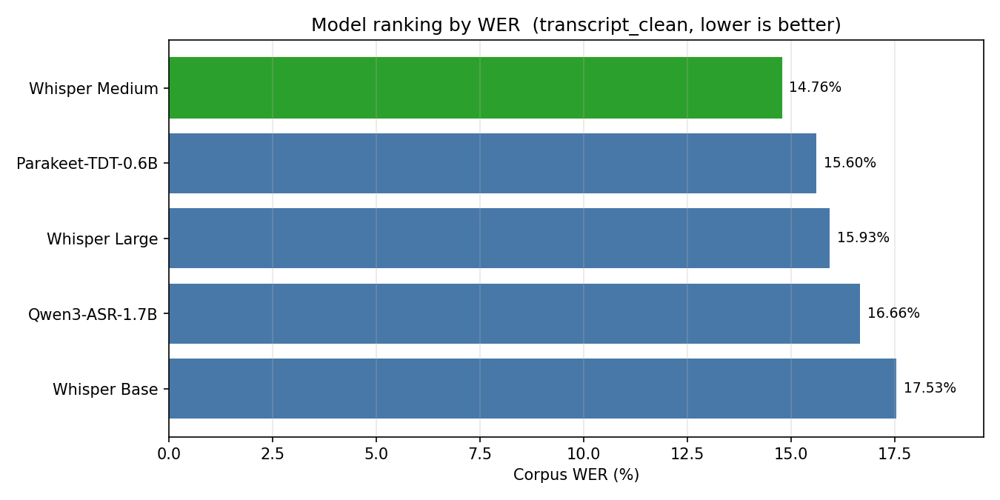
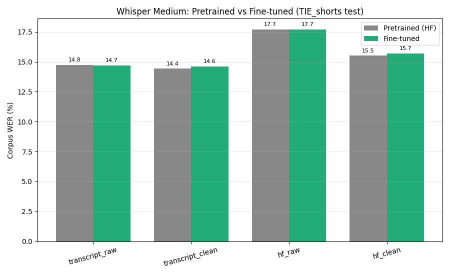

<h1 align="center">Indian-ASR-Bench</h1>

<p align="center">
  
  
  
  
  <a href="https://huggingface.co/datasets/raianand/TIE_shorts">
    
  </a>
  <a href="https://huggingface.co/theshivam7/whisper-medium-indian-english">
    
  </a>
</p>

<p align="center">
  <b>A reproducible Word Error Rate benchmark for ASR on Indian English academic speech —<br>
  six models, four normalization modes, and an honest in-domain fine-tuning study.</b>
</p>

<p align="center">
  <a href="#results">Results</a> &nbsp;·&nbsp;
  <a href="#fine-tuning-whisper-medium">Fine-tuning</a> &nbsp;·&nbsp;
  <a href="#evaluation-methodology">Methodology</a> &nbsp;·&nbsp;
  <a href="#reproducing-results">Reproduce</a>
</p>

---

## Motivation

ASR benchmarks are dominated by American and British English. Indian English — spoken by over a billion people, with distinct phonology, regional accents, and code-switching — is under-evaluated, and academic lectures (rapid speech, technical vocabulary, heavy male-speaker skew) are an especially hard and practically important slice.

This project does two things:

1. **Benchmarks five pretrained ASR systems** on the [TIE_shorts](https://huggingface.co/datasets/raianand/TIE_shorts) `test` split (986 NPTEL-style lecture clips), across four normalization modes and every demographic/acoustic breakdown.
2. **Fine-tunes Whisper Medium** on the in-domain `train` split and evaluates it under an engine-controlled comparison — reporting a **null result** transparently (see [Fine-tuning](#fine-tuning-whisper-medium)).

A recurring theme: **how you normalize text moves WER as much as which model you pick.**

---

## Models

| Model | Parameters | Architecture | Reference |
|-------|:----------:|:------------:|-----------|
| **Whisper Base** | 74M | Encoder-Decoder | [openai/whisper-base](https://huggingface.co/openai/whisper-base) |
| **Whisper Medium** | 769M | Encoder-Decoder | [openai/whisper-medium](https://huggingface.co/openai/whisper-medium) |
| **Whisper Large** | ~1.5B | Encoder-Decoder | [openai/whisper-large](https://huggingface.co/openai/whisper-large) |
| **Parakeet-TDT-0.6B-v2** | 600M | CTC + TDT | [nvidia/parakeet-tdt-0.6b-v2](https://huggingface.co/nvidia/parakeet-tdt-0.6b-v2) |
| **Qwen3-ASR-1.7B** | 1.7B | LLM-based | [Qwen/Qwen3-ASR-1.7B](https://huggingface.co/Qwen/Qwen3-ASR-1.7B) |
| **Whisper Medium (fine-tuned)** | 769M | Encoder-Decoder | [theshivam7/whisper-medium-indian-english](https://huggingface.co/theshivam7/whisper-medium-indian-english) — *this project* |

The first five are evaluated as **pretrained systems** (the headline benchmark). The sixth is our in-domain fine-tune, analyzed with the same depth in [Fine-tuning Whisper Medium](#fine-tuning-whisper-medium).

---

## Dataset

**[raianand/TIE_shorts](https://huggingface.co/datasets/raianand/TIE_shorts)** — the `test` split (986 clips) of the TIE (Talks in Indian English) dataset: NPTEL-style academic lectures. 985 clips are scored (one is excluded for an empty reference).

| Attribute | Distribution |
|-----------|-------------|
| Gender | Male 94.1% (927), Female 5.9% (58) |
| Speech rate | FAST 41.9% (413), SLOW 37.9% (373), AVG 20.2% (199) |
| Region | SOUTH 36.8% (362), EAST 35.7% (352), NORTH 20.5% (202), WEST 7.0% (69) |
| Discipline | Engineering 70.2% (691), Non-Engineering 29.8% (294) |

---

## Results

All numbers are corpus/per-sample WER on the `test` split under **`transcript_clean`** (the gold-standard mode — forward normalization applied symmetrically to reference and hypothesis; see [Methodology](#evaluation-methodology)). Regenerated directly from `results/`.

### Primary metric: `transcript_clean`

| Model | Corpus WER | Mean WER | Median WER | Std Dev | P90 | P95 |
|-------|:----------:|:--------:|:----------:|:-------:|:---:|:---:|
| **Whisper Medium** | **14.76%** | **15.45%** | **11.11%** | **15.90%** | **31.58%** | **39.62%** |
| Parakeet-TDT-0.6B | 15.60% | 16.75% | 11.86% | 17.47% | 34.38% | 44.12% |
| Whisper Large | 15.93% | 16.88% | 11.43% | 19.20% | 35.21% | 48.94% |
| Qwen3-ASR-1.7B | 16.66% | 17.34% | 12.90% | 15.93% | 35.00% | 45.07% |
| Whisper Base | 17.53% | 18.38% | 13.51% | 16.95% | 38.16% | 50.00% |

> The **fine-tuned** Whisper Medium is not in this ranking because it runs through a different decoder (HuggingFace `transformers`, not `openai-whisper`) — mixing it here would confound fine-tuning with a decoding-engine change. Its fair, engine-controlled comparison is in [Fine-tuning](#fine-tuning-whisper-medium).

<p align="center">
  
</p>

### Key findings

1. **Whisper Medium is best overall (14.76%)** — and also the most consistent (lowest Std Dev and lowest median WER).
2. **Parakeet-TDT-0.6B (15.60%) beats Whisper Large (15.93%)** — a 600M specialized model edges out a ~1.5B general-purpose one.
3. **Whisper Large is the least stable** (Std Dev 19.20%) — it hallucinates on the hardest clips.
4. **Parakeet and Qwen3 dominate long audio (60s+):** 18–21% vs 37–38% for the Whisper models.
5. **Normalization/reference choice moves WER by ~2–3 pp** — comparable to the spread between the best and worst models (see below).

### Impact of normalization

| Mode | Base | Medium | Large | Parakeet | Qwen3 |
|------|:----:|:------:|:-----:|:--------:|:-----:|
| `transcript_raw` (minimal cleanup) | 17.91% | 15.11% | 16.31% | 15.97% | 18.15% |
| `transcript_clean` (**gold standard**) | 17.53% | **14.76%** | 15.93% | 15.60% | 16.66% |
| `hf_raw` (dataset's normalization, broken) | 20.24% | 18.01% | 19.14% | 18.54% | 17.99% |
| `hf_clean` (dataset norm + our fix) | 18.07% | 15.76% | 16.94% | 16.40% | 17.61% |

The dataset's own `Normalised_Transcript` (`hf_raw`) is **2–3 pp worse** than using the gold `Transcript` with correct normalization — it splits ordinals into characters (`"1st"` → `"one s t"`). **Always use `transcript_clean`.**

### Breakdown by speech rate

| Speech Rate | Base | Medium | Large | Parakeet | Qwen3 | Samples |
|:-----------:|:----:|:------:|:-----:|:--------:|:-----:|:-------:|
| FAST | 16.51% | **13.54%** | 13.85% | 14.38% | 15.63% | 413 |
| AVG | 15.96% | **13.41%** | 16.01% | 13.95% | 15.69% | 199 |
| SLOW | 19.87% | 17.24% | 18.72% | 18.25% | **18.65%** | 373 |

### Breakdown by region

| Region | Base | Medium | Large | Parakeet | Qwen3 | Samples |
|:------:|:----:|:------:|:-----:|:--------:|:-----:|:-------:|
| EAST | 16.81% | **13.95%** | 16.95% | 15.44% | 15.81% | 352 |
| NORTH | 17.07% | **14.74%** | 15.10% | 16.06% | 16.26% | 202 |
| SOUTH | 18.44% | **15.34%** | 15.67% | 15.64% | 17.66% | 362 |
| WEST | 17.34% | 15.47% | 15.06% | **14.86%** | 16.51% | 69 |

### Breakdown by audio duration

| Duration | Base | Medium | Large | Parakeet | Qwen3 |
|:--------:|:----:|:------:|:-----:|:--------:|:-----:|
| 0–5s | 25.00% | 25.00% | 25.00% | 40.00% | 30.00% |
| 5–15s | 25.11% | 21.61% | 25.28% | 23.91% | 23.65% |
| **15–30s** | 16.97% | **13.82%** | 14.77% | 14.96% | 15.98% |
| 30–60s | 19.63% | 19.83% | 22.35% | **18.93%** | 20.62% |
| **60s+** | 33.33% | 37.31% | 38.23% | **18.35%** | 20.80% |

Parakeet and Qwen3 are far more robust on 60s+ clips — Whisper hallucinates during long pauses; the TDT/LLM decoders do not.

### Breakdown by gender

| Gender | Base | Medium | Large | Parakeet | Qwen3 | Samples |
|:------:|:----:|:------:|:-----:|:--------:|:-----:|:-------:|
| Female | 13.92% | 12.05% | 12.46% | **11.78%** | 14.05% | 58 |
| Male | 17.74% | **14.92%** | 16.14% | 15.83% | 16.82% | 927 |

### Breakdown by discipline

| Discipline | Base | Medium | Large | Parakeet | Qwen3 | Samples |
|:----------:|:----:|:------:|:-----:|:--------:|:-----:|:-------:|
| Engineering | 18.00% | 15.09% | 16.06% | 16.30% | 17.14% | 691 |
| Non-Engineering | 16.42% | **13.99%** | 15.64% | **13.95%** | 15.55% | 294 |

### YouTube captions (archived reference)

YouTube auto-captions, evaluated on the 190 clips (19.3%) with available English captions via clip-aligned Jaccard matching, score **51.88% WER** — 3.8× worse than Whisper Medium on the same clips (13.67%). Not directly comparable to the main benchmark; kept for reference in [`archived_tasks/youtube_captions/`](archived_tasks/youtube_captions/).

---

## Fine-tuning Whisper Medium

We fully fine-tune Whisper Medium (the strongest pretrained model here) on the `train` split and evaluate on the **same** `test` split, then compare it against pretrained Whisper Medium **decoded through the identical HF pipeline** (`medium_hf`) — so the comparison isolates fine-tuning from any decoding-engine effect.

**Setup:** full fine-tune (769M params) via `transformers` `Seq2SeqTrainer`; targets = gold `Transcript`; bf16 + gradient checkpointing; LR 1e-5, weight decay 0.01, warmup 10%, SpecAugment; early stopping (patience 2) on validation WER with `load_best_model_at_end`; clips >30s filtered for training. Full hyperparameters in [`task6_whisper_medium_ft/finetune.py`](task6_whisper_medium_ft/finetune.py).

### Result: fine-tuning does not beat the pretrained model

Engine-controlled, `transcript_clean`, both decoded through the same HF chunked pipeline:

| Model | Corpus WER | Mean WER | Median WER | Std Dev | P90 | P95 |
|-------|:----------:|:--------:|:----------:|:-------:|:---:|:---:|
| Whisper Medium — pretrained (`medium_hf`) | **14.42%** | **14.64%** | **9.84%** | 22.19% | 30.30% | 40.00% |
| Whisper Medium — fine-tuned (`medium_ft`) | 14.61% | 14.80% | 10.14% | 27.70% | **27.87%** | **36.62%** |

Corpus WER across all four modes:

| Mode | Pretrained (`medium_hf`) | Fine-tuned (`medium_ft`) | Δ |
|------|:------------------------:|:------------------------:|:---:|
| `transcript_clean` (gold) | 14.42% | 14.61% | +0.20 pp |
| `transcript_raw` | 14.75% | 14.71% | −0.04 pp |
| `hf_clean` | 15.51% | 15.70% | +0.19 pp |
| `hf_raw` | 17.72% | 17.70% | −0.02 pp |

The +0.20 pp gap is within single-run noise, so the honest claim is **"no significant gain," not "fine-tuning hurts."**

<p align="center">
  
</p>

### Fine-tuned breakdowns (same analysis as the pretrained models)

**By speech rate**

| Speech Rate | Pretrained (`medium_hf`) | Fine-tuned (`medium_ft`) | Δ | Samples |
|:-----------:|:---:|:---:|:---:|:---:|
| FAST | 11.91% | 12.28% | +0.37 pp | 413 |
| AVG | 14.64% | 15.75% | +1.11 pp | 199 |
| SLOW | 17.69% | 17.10% | −0.59 pp | 373 |

**By region**

| Region | Pretrained (`medium_hf`) | Fine-tuned (`medium_ft`) | Δ | Samples |
|:------:|:---:|:---:|:---:|:---:|
| EAST | 14.08% | 14.66% | +0.58 pp | 352 |
| NORTH | 13.92% | 13.31% | −0.61 pp | 202 |
| SOUTH | 14.08% | 13.66% | −0.42 pp | 362 |
| WEST | 18.84% | 22.53% | +3.69 pp | 69 |

**By gender**

| Gender | Pretrained (`medium_hf`) | Fine-tuned (`medium_ft`) | Δ | Samples |
|:------:|:---:|:---:|:---:|:---:|
| Female | 19.08% | 24.30% | +5.22 pp | 58 |
| Male | 14.14% | 14.03% | −0.11 pp | 927 |

**By discipline**

| Discipline | Pretrained (`medium_hf`) | Fine-tuned (`medium_ft`) | Δ | Samples |
|:----------:|:---:|:---:|:---:|:---:|
| Engineering | 14.39% | 14.46% | +0.07 pp | 691 |
| Non-Engineering | 14.48% | 14.97% | +0.49 pp | 294 |

**By audio duration**

| Duration | Pretrained (`medium_hf`) | Fine-tuned (`medium_ft`) | Δ |
|:--------:|:---:|:---:|:---:|
| 0–5s | 25.00% | 35.00% | +10.00 pp |
| 5–15s | 21.01% | 20.92% | −0.09 pp |
| 15–30s | 12.20% | 12.29% | +0.09 pp |
| 30–60s | 25.41% | 25.69% | +0.28 pp |
| 60s+ | 119.27% | 133.03% | +13.76 pp |

### Why the pretrained model is already hard to beat

- **Little headroom** — pretrained Whisper Medium (680k hours) already sits at 14.42%; the residual errors (technical vocabulary, math notation, code-switching) aren't fixable from a small in-domain set.
- **Scale mismatch → overfitting** — 769M params on ~7.9k clips is data-starved; the best checkpoint arrived at **epoch 1** and early-stopping fired by epoch 3.
- **Tail regressions** — the train set is ~94% male / ~70% engineering; fine-tuning fit that majority and **regressed on under-represented groups** (Female +5.22 pp, WEST +3.69 pp, 0–5s +10 pp), for a net wash (250 clips improved vs 307 regressed).

> **Long-clip decoding note.** On 60s+ clips the HF chunked pipeline scores ~119% WER for *both* the pretrained and fine-tuned models, vs 37% for the same weights under `openai-whisper`. That is a **decoding-pipeline artifact** (long-form chunk stitching), not a fine-tuning effect — it hits both equally, so the head-to-head stays fair. It also inflates the Std Dev in the tables above.

> ⚠️ **Speaker overlap (disclosed).** The dataset's official splits share speakers: **100% of test speakers — and 100% of test clips — come from speakers also seen in training** ([`speaker_overlap.md`](results/analysis/speaker_overlap.md), via [`check_speaker_overlap.py`](task6_whisper_medium_ft/check_speaker_overlap.py)). There is **no clip-level leakage**, but the comparison is *speaker-matched*, so any effect partly reflects speaker adaptation. The official splits were not modified; this is disclosed so the numbers read correctly.

Model card and usage: **[theshivam7/whisper-medium-indian-english](https://huggingface.co/theshivam7/whisper-medium-indian-english)**.

---

## Evaluation Methodology

Four modes cover **2 reference sources × 2 normalization states**, always applied symmetrically (same normalization to reference and hypothesis):

| Mode | Reference | Normalization | Purpose |
|------|-----------|:-------------:|---------|
| `transcript_raw` | `Transcript` | Minimal (case/punct/quotes) | Near-upper-bound baseline |
| `transcript_clean` | `Transcript` | Forward (full) | **Gold standard — primary metric** |
| `hf_raw` | `Normalised_Transcript` | Minimal | Quantifies dataset normalization errors |
| `hf_clean` | `Normalised_Transcript` | Forward (full) | Dataset norm + our fix |

**Forward normalization** (the `*_clean` modes): Unicode NFC → fix possessives (`"Bernoulli's"` → `"bernoulli s"`) → ordinals/cardinals to words (`"1st"` → `"first"`, `"100"` → `"one hundred"`) → lowercase → strip punctuation → collapse whitespace. Contractions are intentionally **left unexpanded** (`"don't"` → `"dont"`, applied to both sides) so the metric doesn't reward a rewrite neither transcript uses.

The `*_raw` modes apply **minimal cleanup** only — strip wrapping quotes, lowercase, remove punctuation — with no number/possessive handling.

**Why the dataset's `Normalised_Transcript` is unreliable:** it maps `"the 1st component"` → `"the one s t component"` (ordinal split into characters), affecting 50+ clips and inflating `hf_raw` WER by 2–3 pp. Use `transcript_clean`.

---

## Reproducing Results

**Analysis only (no GPU)** — recompute every table above from the committed transcripts:

```bash
git clone https://github.com/theshivam7/indian-asr-bench && cd indian-asr-bench
pip install -r requirements.txt
python normalize_and_score.py    # Stage 2: 4-mode WER from results/stage1_raw_transcripts/
python analysis/compare_all.py   # Stage 3: breakdowns + charts → results/analysis/
```

**Transcription (GPU)** — each model has its own conda env and driver script:

```bash
bash task2_whisper_medium/setup.sh          # per-model env (task1..task5)
conda activate whisper_medium
python task2_whisper_medium/wer_whisper_medium.py   # resumable → results/stage1_raw_transcripts/
```

**Fine-tuning (GPU)** — train, then evaluate the fine-tune + same-engine baseline:

```bash
bash task6_whisper_medium_ft/setup.sh
python task6_whisper_medium_ft/check_speaker_overlap.py     # pre-flight leakage disclosure
python task6_whisper_medium_ft/finetune.py                  # → models/whisper_medium_ft/
MODEL_NAME=medium_hf python task6_whisper_medium_ft/wer_whisper_medium_ft.py
MODEL_NAME=medium_ft python task6_whisper_medium_ft/wer_whisper_medium_ft.py
```

Conda specs are in [`environments/`](environments/); PBS/SLURM job scripts and cluster config in [`hpc/`](hpc/). All transcriptions were run on a single **NVIDIA A100-40GB** (NSCC ASPIRE2A).

---

## Common Error Patterns

- **Mathematical notation** (`ds/dt = πr²H`) has no canonical spoken form — variable names are frequently misrecognized.
- **Long-pause hallucination** — Whisper generates filler during silences; Parakeet and Qwen3 are more robust.
- **Technical vocabulary** (`gel permeation chromatography`) is missed across all models.
- **Very short clips (0–5s)** — one wrong word can push WER past 100%.
- **Code-switching** — Hindi/regional words in English lectures cause confusion.

---

## About

Built by **Shivam Sharma** (student at **IIT Madras**) during a research internship at **Nanyang Technological University (NTU), Singapore**. The project provides a reproducible, transparently-documented WER benchmark for Indian English academic speech — including a deliberately-disclosed negative fine-tuning result — so that both the strong pretrained baselines and the limits of in-domain fine-tuning are visible to other researchers.

Contributions welcome — see [CONTRIBUTING.md](CONTRIBUTING.md).

---

## License

MIT — see [LICENSE](LICENSE). The dataset ([raianand/TIE_shorts](https://huggingface.co/datasets/raianand/TIE_shorts)) is under its own license; review the dataset card before use.
