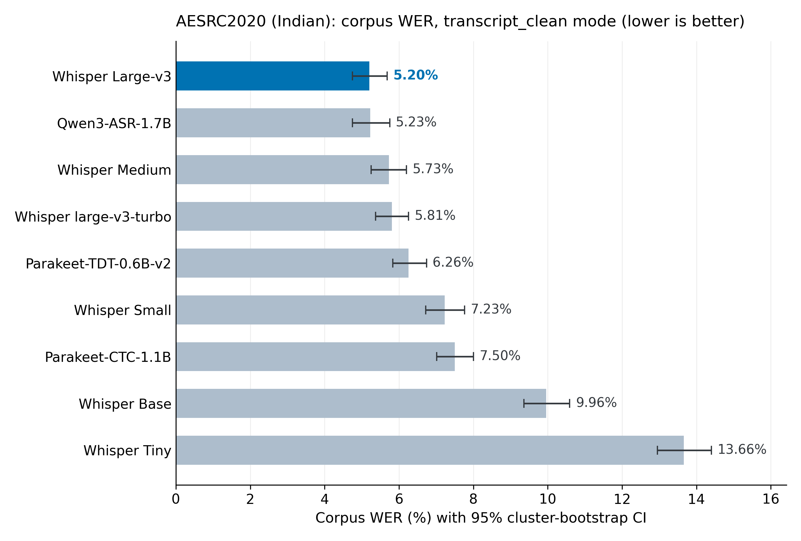
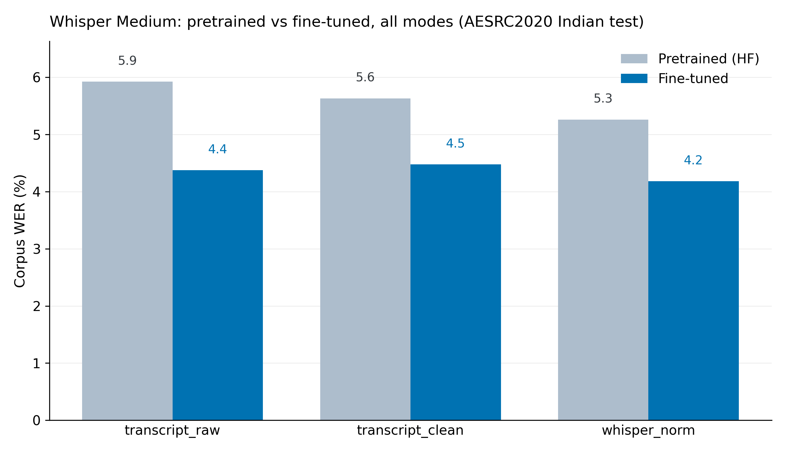

# Full results and analysis

Detailed companion to [README.md](README.md): every breakdown table, statistical test, normalization
detail, and error-analysis finding behind the headline numbers. Start with the README for the
overview; come here for the evidence.

## Contents

- [Pipeline in detail](#pipeline-in-detail)
- [Models](#models)
- [Datasets](#datasets)
- [Results: TIE_shorts](#results-tie_shorts)
- [Results: Svarah](#results-svarah)
- [Results: AESRC2020 (Indian)](#results-aesrc2020-indian)
- [Fine-tuning and split design](#fine-tuning-and-split-design)
- [Inference efficiency](#inference-efficiency)
- [Normalization](#normalization)
- [Error analysis](#error-analysis)
- [Limitations](#limitations)
- [Future work](#future-work)

---

## Pipeline in detail

| Step | What it does | Output |
|---|---|---|
| Registry | [`utils/registry.py`](utils/registry.py) defines every model, dataset, mode, and display name. Single source of truth. | - |
| Stage 1 | An engine driver transcribes a dataset's eval split. Committed and immutable: the reproducibility anchor. | `results/<dataset>/stage1_raw_transcripts/` |
| Stage 2 | [`normalize_and_score.py`](normalize_and_score.py) computes per-clip WER/CER under every normalization mode. | `results/<dataset>/stage2_processed/` |
| Stage 3 | Comparisons, cluster-bootstrap statistics, error taxonomy, fine-tuning reports, charts. | `results/<dataset>/analysis/` |

Any normalization or metric change re-runs Stages 2 and 3 from the committed transcripts. No re-inference needed.

Extending the benchmark:

- **New dataset**: add one `DatasetSpec` to the registry. No other file changes.
- **New model**: add one `ModelSpec`, then run its engine driver with `--model`.
- **New metric**: add it to [`utils/wer_compute.py`](utils/wer_compute.py) and surface it in Stage 2/3.

**Decode settings**, per engine (recorded per-run in `results/<dataset>/stage1_raw_transcripts/wer_<model>_manifest.json`: model + dataset revisions, package versions, git commit, decode kwargs, host, timestamp):

| Engine | Explicit settings | Everything else |
|---|---|---|
| openai-whisper (base/medium/large/large-v3-turbo) | `language="en"` (+ `fp16=False` on CPU) | library defaults: greedy decoding with temperature fallback (0.0 to 1.0 in 0.2 steps on quality-gate failure), `condition_on_previous_text=True`, default no-speech/compression thresholds |
| hf_whisper (HF baselines and fine-tuned models, e.g. medium_hf / medium_aesrc_ft) | chunked `transformers` pipeline ([`utils/transcribe_hf.py`](utils/transcribe_hf.py)) | library defaults |
| NeMo (parakeet / parakeet_ctc) | batch transcription, `batch_size=16` | library defaults |
| qwen3 | `language="English"`, `max_new_tokens=512` | library defaults |

openai-whisper's temperature fallback is stochastic: clips that fail the compression-ratio/log-prob gates at temperature 0 are re-decoded at sampled temperatures, so re-running Stage 1 from scratch can produce slightly different transcripts for those clips. `condition_on_previous_text=True` additionally couples 30-second windows in clips longer than 30s. Decode settings were left at community defaults deliberately: they are what practitioners run, and changing them mid-project would break comparability with completed runs. This is why the **committed Stage-1 raw CSVs are the reproducibility anchor** rather than the decode process itself.

HF dataset revisions are pinned in [`utils/registry.py`](utils/registry.py) (`hf_revision`) and passed to `load_dataset`, so an upstream dataset update cannot silently change the benchmark. The `whisper_norm` mode uses [`whisper_normalizer==0.1.0`](https://pypi.org/project/whisper-normalizer/), verified byte-identical to [`openai/whisper`](https://github.com/openai/whisper)'s reference `EnglishTextNormalizer` on all 7,391 distinct reference/hypothesis strings in the TIE corpus.

---

## Models

| Model | Parameters | Architecture | Reference |
|-------|:----------:|:------------:|-----------|
| Whisper Tiny | 39M | Encoder-Decoder | [openai/whisper-tiny](https://huggingface.co/openai/whisper-tiny) |
| Whisper Base | 74M | Encoder-Decoder | [openai/whisper-base](https://huggingface.co/openai/whisper-base) |
| Whisper Small | 244M | Encoder-Decoder | [openai/whisper-small](https://huggingface.co/openai/whisper-small) |
| Whisper Medium | 769M | Encoder-Decoder | [openai/whisper-medium](https://huggingface.co/openai/whisper-medium) |
| Whisper Large-v3 | ~1.5B | Encoder-Decoder | [openai/whisper-large-v3](https://huggingface.co/openai/whisper-large-v3) |
| Whisper large-v3-turbo | 809M | Encoder-Decoder | [openai/whisper-large-v3-turbo](https://huggingface.co/openai/whisper-large-v3-turbo) |
| Parakeet-TDT-0.6B-v2 | 600M | CTC + TDT | [nvidia/parakeet-tdt-0.6b-v2](https://huggingface.co/nvidia/parakeet-tdt-0.6b-v2) |
| Parakeet-CTC-1.1B | 1.1B | CTC | [nvidia/parakeet-ctc-1.1b](https://huggingface.co/nvidia/parakeet-ctc-1.1b) |
| Qwen3-ASR-1.7B | 1.7B | LLM-based | [Qwen/Qwen3-ASR-1.7B](https://huggingface.co/Qwen/Qwen3-ASR-1.7B) |
| Whisper Tiny (AESRC fine-tuned) | 39M | Encoder-Decoder | [theshivam7/whisper-tiny-aesrc-indian-english](https://huggingface.co/theshivam7/whisper-tiny-aesrc-indian-english) |
| Whisper Small (AESRC fine-tuned) | 244M | Encoder-Decoder | [theshivam7/whisper-small-aesrc-indian-english](https://huggingface.co/theshivam7/whisper-small-aesrc-indian-english) |
| Whisper Medium (AESRC fine-tuned) | 769M | Encoder-Decoder | [theshivam7/whisper-medium-aesrc-indian-english](https://huggingface.co/theshivam7/whisper-medium-aesrc-indian-english) |

A TIE fine-tuned set (Tiny/Small/Medium) also exists and stays published on the HF Hub, but is
archived from the main benchmark, see [Archived: TIE_shorts fine-tuning](archived_tasks/tie_finetuning/README.md).

All nine pretrained models run as-is on all three datasets; that is the headline benchmark. Fine-tuning is analyzed separately: a Tiny/Small/Medium capacity study on AESRC (natively speaker-disjoint), where the fine-tuning gain is real. Fine-tuned models are excluded from the pretrained ranking tables below because they decode through a different engine (HF `transformers` rather than `openai-whisper`); their engine-controlled comparison is in [Fine-tuning](#fine-tuning-and-split-design).

---

## Datasets

**[raianand/TIE_shorts](https://huggingface.co/datasets/raianand/TIE_shorts)**: academic lecture audio scraped from YouTube (NPTEL style). "Found" data, no controlled recording protocol.

**[ai4bharat/Svarah](https://huggingface.co/datasets/ai4bharat/Svarah)**: read-speech prompts recorded under a controlled protocol. "Curated" data, the counterpoint to TIE.

**[pengyizhou/accented_english](https://huggingface.co/datasets/pengyizhou/accented_english)** (AESRC2020, Indian subset): short read commands and queries from the Accented English Speech Recognition Challenge 2020 ([Shi et al., ICASSP 2021](https://arxiv.org/abs/2102.10233)). The mirror carries 8 national accents; the pipeline filters to `accent == INDIAN` on load. Its test split is natively speaker-disjoint from train (481 vs 38 speakers, zero overlap), which makes it the clean instrument for the fine-tuning capacity study. The mirror states no license and the corpus is Datatang's; access and permission to use it for this research were confirmed through our advisor.

| Dataset | Split | Clips | Duration | Mean / clip | Median / clip |
|---------|:-----:|------:|:--------:|:-----------:|:--------------:|
| TIE_shorts | train | 7,200 (filtered from 7,884 raw) | 46.9h | - | - |
| TIE_shorts | validation | 986 | 6.84h | 24.98s | 24.62s |
| TIE_shorts | test (eval, scored) | 986 (985 scored, 1 empty reference) | 6.72h | 24.53s | 24.20s |
| Svarah | test (eval-only, scored) | 6,656 | 9.61h | 5.20s | 4.21s |
| AESRC (Indian) | train | 12,820 | 17.48h | 4.91s | - |
| AESRC (Indian) | validation | 532 | 0.76h | 5.12s | - |
| AESRC (Indian) | test (eval, scored) | 1,731 | 2.15h | 4.47s | - |

TIE's and AESRC's `test` splits are the eval sets; `train` and `validation` are used only for fine-tuning. Svarah has no train or validation split and is eval-only.

**TIE_shorts test-split demographics:**

| Attribute | Distribution |
|-----------|-------------|
| Gender | Male 94.1% (927), Female 5.9% (58) |
| Speech rate | FAST 41.9% (413), SLOW 37.9% (373), AVG 20.2% (199) |
| Region | SOUTH 36.8% (362), EAST 35.7% (352), NORTH 20.5% (202), WEST 7.0% (69) |
| Discipline | Engineering 70.2% (691), Non-Engineering 29.8% (294) |

**Svarah test-split demographics:**

| Attribute | Distribution |
|-----------|-------------|
| Gender | Female 53.8% (3,579), Male 46.2% (3,077) |
| Age | 30-45 40.1% (2,670), 18-30 33.3% (2,219), 45-60 19.6% (1,305), 60+ 6.9% (462) |
| Native language | 19 languages (Assamese, Bengali, Bodo, Gujarati, Hindi, Kannada, and more); 65 districts per the [dataset paper](https://arxiv.org/abs/2305.15760) |

---

## Results: TIE_shorts

All numbers are WER on the `test` split under **`transcript_clean`**, the gold mode: forward normalization applied symmetrically to reference and hypothesis (see [Normalization](#normalization)).

#### Primary metric: `transcript_clean`

| Model | Corpus WER | Mean WER | Median WER | Std Dev | P90 | P95 |
|-------|:----------:|:--------:|:----------:|:-------:|:---:|:---:|
| Whisper Medium | 14.76% | 15.45% | 11.11% | 15.90% | 31.58% | 39.62% |
| Parakeet-TDT-0.6B-v2 | 15.60% | 16.75% | 11.86% | 17.47% | 34.38% | 44.12% |
| Whisper Large-v3 | 15.93% | 16.88% | 11.43% | 19.20% | 35.21% | 48.94% |
| Whisper Small | 16.05% | 16.90% | 12.20% | 17.78% | 34.38% | 46.00% |
| Parakeet-CTC-1.1B | 16.45% | 17.23% | 12.90% | 15.95% | 34.69% | 44.19% |
| Qwen3-ASR-1.7B | 16.66% | 17.34% | 12.90% | 15.93% | 35.00% | 45.07% |
| Whisper Base | 17.53% | 18.38% | 13.51% | 16.95% | 38.16% | 50.00% |
| Whisper large-v3-turbo | 17.98% | 18.80% | 12.00% | 23.62% | 38.89% | 56.52% |
| Whisper Tiny | 19.43% | 20.49% | 16.28% | 17.41% | 40.28% | 51.76% |

  

Statistical check: speaker-clustered paired bootstrap over 280 speakers, Holm-corrected across all 36 pairs ([full tables](results/tie/analysis/statistics_transcript_clean.md)).

- 23 of the 36 pairs are significant.
- Whisper Medium beats Small (-1.29 pp) and Large-v3 (-1.17 pp). A smaller model wins against bigger ones here.
- Medium's edge over Parakeet-TDT (-0.84 pp) narrowly misses significance (pHolm=0.052).
- Small, Large-v3, both Parakeets, and Qwen3 are mutually indistinguishable in most pairings.
- Whisper Base (74M) is statistically tied with large-v3-turbo (809M), diff -0.45 pp. Model size alone does not predict rank here.

#### Cross-check: `whisper_norm`

Corpus WER under OpenAI's `EnglishTextNormalizer` instead of this project's `transcript_clean` normalizer, same gold reference. Computed for every model alongside the primary metric.

| Model | `transcript_clean` (gold) | `whisper_norm` | Δ |
|-------|:--------------------------:|:---------------:|:-:|
| Whisper Medium | 14.76% | 14.48% | -0.28 pp |
| Parakeet-TDT-0.6B-v2 | 15.60% | 15.17% | -0.43 pp |
| Whisper Large-v3 | 15.93% | 15.76% | -0.17 pp |
| Whisper Small | 16.05% | 15.80% | -0.25 pp |
| Parakeet-CTC-1.1B | 16.45% | 16.19% | -0.26 pp |
| Qwen3-ASR-1.7B | 16.66% | 15.40% | -1.26 pp |
| Whisper Base | 17.53% | 17.03% | -0.50 pp |
| Whisper large-v3-turbo | 17.98% | 17.75% | -0.23 pp |
| Whisper Tiny | 19.43% | 19.01% | -0.42 pp |

`whisper_norm` lowers every model's WER, but unevenly: Qwen3 moves the most (-1.26 pp), rising from 6th to 3rd place and passing both Large-v3 and Small, while the Whisper family barely shifts (~0.2 to 0.5 pp). `transcript_clean` remains the primary metric throughout.

#### Key findings

1. Whisper Medium wins at 14.76% corpus WER, and it is also the steadiest model here, with the lowest Std Dev and median of the nine.
2. Parakeet-TDT (600M, 15.60%) edges out Whisper Large-v3 (~1.5B, 15.93%), though not by a significant margin.
3. WER falls as Whisper capacity grows, up to Medium (Tiny 19.43%, Base 17.53%, Small 16.05%, Medium 14.76%), then climbs back up at Large-v3 and large-v3-turbo. Bigger is not better on this data.
4. large-v3-turbo is the least stable model in the study, with the highest Std Dev (23.62%). It hallucinates on hard clips more than anything else tested here.
5. Reference and normalizer choice alone move WER by 2.3 to 3.5 pp on this dataset (see [Normalization](#normalization)).

The five breakdowns below use the top 5 models by corpus WER (Medium, Parakeet-TDT, Large-v3, Small, Parakeet-CTC).

#### Breakdown by speech rate

| Speech Rate | Medium | Parakeet-TDT | Large-v3 | Small | Parakeet-CTC | Samples |
|:-----------:|:------:|:-------------:|:--------:|:-----:|:------------:|:-------:|
| FAST | 13.54% | 14.38% | 13.85% | 14.53% | 15.44% | 413 |
| AVG | 13.41% | 13.95% | 16.01% | 14.80% | 15.38% | 199 |
| SLOW | 17.24% | 18.25% | 18.72% | 18.88% | 18.47% | 373 |

#### Breakdown by region

| Region | Medium | Parakeet-TDT | Large-v3 | Small | Parakeet-CTC | Samples |
|:------:|:------:|:-------------:|:--------:|:-----:|:------------:|:-------:|
| EAST | 13.95% | 15.44% | 16.95% | 15.71% | 15.99% | 352 |
| NORTH | 14.74% | 16.06% | 15.10% | 16.22% | 16.61% | 202 |
| SOUTH | 15.34% | 15.64% | 15.67% | 16.03% | 16.86% | 362 |
| WEST | 15.47% | 14.86% | 15.06% | 17.22% | 15.97% | 69 |

#### Breakdown by audio duration

| Duration | Medium | Parakeet-TDT | Large-v3 | Small | Parakeet-CTC |
|:--------:|:------:|:-------------:|:--------:|:-----:|:------------:|
| 0-5s | 25.00% | 40.00% | 25.00% | 25.00% | 30.00% |
| 5-15s | 21.61% | 23.91% | 25.28% | 22.46% | 25.36% |
| 15-30s | 13.82% | 14.96% | 14.77% | 14.90% | 15.79% |
| 30-60s | 19.83% | 18.93% | 22.35% | 22.60% | 19.83% |
| 60s+ | 37.31% | 18.35% | 38.23% | 45.87% | 20.18% |

Both Parakeet variants hold steady on 60s+ clips while every Whisper size degrades: Whisper hallucinates during long pauses, the TDT/CTC decoders do not. The extreme buckets are tiny (n=4 for 0-5s, n=5 for 60s+), so read them qualitatively; 87% of clips sit in 15-30s.

#### Breakdown by gender

| Gender | Medium | Parakeet-TDT | Large-v3 | Small | Parakeet-CTC | Samples |
|:------:|:------:|:-------------:|:--------:|:-----:|:------------:|:-------:|
| Female | 12.05% | 11.78% | 12.46% | 13.99% | 12.02% | 58 |
| Male | 14.92% | 15.83% | 16.14% | 16.18% | 16.71% | 927 |

#### Breakdown by discipline

| Discipline | Medium | Parakeet-TDT | Large-v3 | Small | Parakeet-CTC | Samples |
|:----------:|:------:|:-------------:|:--------:|:-----:|:------------:|:-------:|
| Engineering | 15.09% | 16.30% | 16.06% | 16.36% | 16.89% | 691 |
| Non-Engineering | 13.99% | 13.95% | 15.64% | 15.35% | 15.41% | 294 |

#### YouTube captions (archived reference)

YouTube auto-captions score 51.88% WER on the 190 clips with available English captions, 3.8x worse than Whisper Medium on the same clips (13.67%). Not directly comparable to the main benchmark; kept in [`archived_tasks/youtube_captions/`](archived_tasks/youtube_captions/).

---

## Results: Svarah

Svarah has no alternate dataset-provided reference, so three modes apply: `transcript_raw`, `transcript_clean` (gold), and `whisper_norm`. All nine models were run.

#### Primary metric: `transcript_clean`

| Model | Corpus WER | Mean WER | Median WER | Std Dev | P90 | P95 |
|-------|:----------:|:--------:|:----------:|:-------:|:---:|:---:|
| Whisper Large-v3 | 7.11% | 11.68% | 0.00% | 32.27% | 28.57% | 71.43% |
| Whisper Medium | 7.89% | 13.59% | 0.00% | 45.49% | 33.33% | 100.00% |
| Whisper large-v3-turbo | 8.10% | 13.45% | 0.00% | 63.13% | 33.33% | 100.00% |
| Whisper Small | 10.06% | 17.33% | 0.00% | 93.53% | 37.50% | 100.00% |
| Parakeet-TDT-0.6B-v2 | 11.73% | 17.26% | 2.63% | 35.42% | 50.00% | 100.00% |
| Qwen3-ASR-1.7B | 11.82% | 13.35% | 0.00% | 30.98% | 40.00% | 66.67% |
| Whisper Base | 14.53% | 25.36% | 6.67% | 84.42% | 64.29% | 100.00% |
| Parakeet-CTC-1.1B | 15.65% | 21.80% | 6.67% | 40.95% | 66.67% | 100.00% |
| Whisper Tiny | 19.96% | 34.95% | 11.11% | 212.89% | 83.33% | 100.00% |

  

Reading the distribution columns:

- Median WER is 0.00% for six of nine models. Svarah has many short read prompts that good models get exactly right, so corpus WER is the more informative headline.
- Std Dev is far higher than on TIE (Tiny: 212.89% vs 17.41%). On isolated-word items a single wrong word can score far above 100% WER (see [Error Analysis](#error-analysis)).

#### By normalization mode

| Model | `transcript_raw` | `transcript_clean` (gold) | `whisper_norm` |
|-------|:---:|:---:|:---:|
| Whisper Large-v3 | 7.49% | 7.11% | 6.80% |
| Whisper Medium | 8.18% | 7.89% | 7.69% |
| Whisper large-v3-turbo | 8.32% | 8.10% | 7.76% |
| Whisper Small | 10.40% | 10.06% | 9.91% |
| Parakeet-TDT-0.6B-v2 | 13.03% | 11.73% | 8.35% |
| Qwen3-ASR-1.7B | 13.48% | 11.82% | 8.32% |
| Whisper Base | 14.88% | 14.53% | 14.37% |
| Parakeet-CTC-1.1B | 17.71% | 15.65% | 11.18% |
| Whisper Tiny | 20.33% | 19.96% | 19.52% |

Same check on Svarah, this time recording-clustered because the public release exposes no speaker IDs: paired bootstrap over 3,232 recording clusters, Holm-corrected across all 36 pairs ([full tables](results/svarah/analysis/statistics_transcript_clean.md)).

- 34 of the 36 pairs are significant.
- The two that are not: Medium vs large-v3-turbo (-0.21 pp) and Parakeet-TDT vs Qwen3 (-0.09 pp). Everywhere else the ranking holds up.

**Key findings:**

1. Whisper Large-v3 wins at 7.11%, roughly half its own TIE score (15.93%). Controlled read speech is just an easier problem than scraped lecture audio.
2. Normalization matters even more here. Parakeet-TDT drops from 13.03% (raw) to 8.35% (whisper_norm), a 4.7 pp swing, and Parakeet-CTC recovers 4.5 pp. Both transcribe fillers like "and uh" or "mm hmm" verbatim, which `transcript_clean` counts as insertions and `whisper_norm` strips out. Whisper models drop fillers by training, so they barely move either way.
3. Svarah really is cleaner than TIE, once the classifier gets audited instead of trusted blindly. Its artifact share among classifiable clips is 0.8%, against TIE's 1.2%. Run the classifier naively and it reports 4.8%, but that is an instrument artifact: isolated-word items auto-flag on any single-word miss ("tree" heard as "three"). On those clips the models disagree with each other (inter-hypothesis distance 0.92), which is the opposite signature of a genuine reference fault (see [Error Analysis](#error-analysis)).

---

## Results: AESRC2020 (Indian)

AESRC's Indian subset is short, prompted read speech (mean 4.47s/clip, filtered to `accent == INDIAN`). Like Svarah it has no alternate dataset-provided reference, so three modes apply: `transcript_raw`, `transcript_clean` (gold), and `whisper_norm`. All nine models were run.

#### Primary metric: `transcript_clean`

| Model | Corpus WER | Mean WER | Median WER | Std Dev | P90 | P95 |
|-------|:----------:|:--------:|:----------:|:-------:|:---:|:---:|
| Whisper Large-v3 | 5.20% | 5.95% | 0.00% | 12.10% | 20.00% | 28.57% |
| Qwen3-ASR-1.7B | 5.23% | 6.12% | 0.00% | 13.35% | 20.00% | 28.57% |
| Whisper Medium | 5.73% | 6.53% | 0.00% | 12.25% | 22.22% | 33.33% |
| Whisper large-v3-turbo | 5.81% | 6.58% | 0.00% | 11.97% | 21.43% | 30.00% |
| Parakeet-TDT-0.6B-v2 | 6.26% | 7.34% | 0.00% | 12.56% | 25.00% | 33.33% |
| Whisper Small | 7.23% | 8.30% | 0.00% | 14.81% | 25.00% | 36.36% |
| Parakeet-CTC-1.1B | 7.50% | 8.75% | 0.00% | 13.74% | 27.27% | 37.50% |
| Whisper Base | 9.96% | 11.33% | 6.67% | 16.53% | 33.33% | 42.86% |
| Whisper Tiny | 13.66% | 15.35% | 9.09% | 19.76% | 40.00% | 50.00% |

  

Statistical check: speaker-clustered paired bootstrap over 481 speakers, Holm-corrected across all 36 pairs ([full tables](results/aesrc/analysis/statistics_transcript_clean.md)).

- 30 of the 36 pairs come out significant, the finest resolution of any dataset in this benchmark, thanks to 481 real test speakers giving far more independent clusters than TIE's 280 or Svarah's 3,232 recording proxies for 117 true speakers.
- Large-v3 and Qwen3 are joint leaders: statistically inseparable from each other (5.20% vs 5.23%, Holm p=1.0), and Large-v3 separates from every model below them. Qwen3 separates from all of them except Medium (p=0.124).
- The chasing trio of Medium, large-v3-turbo, and Parakeet-TDT (5.73-6.26%) has no significant internal pair, and Whisper Small vs Parakeet-CTC (7.23% vs 7.50%) is the remaining tie.

#### By normalization mode

| Model | `transcript_raw` | `transcript_clean` (gold) | `whisper_norm` |
|-------|:---:|:---:|:---:|
| Whisper Large-v3 | 5.39% | 5.20% | 4.78% |
| Qwen3-ASR-1.7B | 5.14% | 5.23% | 4.89% |
| Whisper Medium | 6.05% | 5.73% | 5.41% |
| Whisper large-v3-turbo | 6.13% | 5.81% | 5.56% |
| Parakeet-TDT-0.6B-v2 | 6.19% | 6.26% | 5.93% |
| Whisper Small | 7.52% | 7.23% | 6.96% |
| Parakeet-CTC-1.1B | 7.38% | 7.50% | 7.13% |
| Whisper Base | 10.27% | 9.96% | 9.64% |
| Whisper Tiny | 13.91% | 13.66% | 13.21% |

**Key findings:**

1. Whisper Large-v3 wins at 5.20%, the lowest corpus WER of any model on any dataset in this benchmark. Short, prompted read speech turns out to be the easiest condition tested here.
2. Reference quality on this dataset is excellent. The consensus classifier flags only 0.1% of classifiable clips as artifacts (95% CI 0.0-0.4%), the lowest of all three datasets (TIE 1.2%, Svarah 0.8%), so AESRC's WER numbers need almost no artifact correction.
3. Median WER is 0.00% for seven of nine models. Most clips are short enough that a competent model just gets them right, so corpus WER, pulled up by a harder minority, is again the more honest headline.
4. Qwen3 and Parakeet-TDT buck the trend: both score slightly higher under `transcript_clean` than `transcript_raw` (5.14% to 5.23%, 6.19% to 6.26%). They are the only two of nine models where normalization does not help, which fits with output that is already clean and literal.

---

## Fine-tuning and split design

Whether in-domain fine-tuning helps is only answerable if the test split isolates the effect being claimed. That makes split design an evaluation-validity property, and the two corpora with training splits differ on it sharply.

**TIE_shorts cannot answer the question.** Auditing speaker identity across its official splits ([`speaker_overlap.md`](results/tie/analysis/speaker_overlap.md)) finds 280 of 280 test speakers, and 986 of 986 test clips, coming from speakers that also appear in train. There is no clip-level leakage, and this is the corpus's own released partition rather than a re-split. But every comparison it supports is speaker-matched, so a gain measured on it conflates accent and content adaptation with adaptation to those particular voices. Repairing the split in place does not work either: removing every train speaker who appears in test leaves 567 of 7,200 train clips, a roughly 13x reduction, which would confound split design with training-set size. A Tiny/Small/Medium fine-tuning study was run on TIE first and is archived rather than reported, see [Archived: TIE_shorts fine-tuning](archived_tasks/tie_finetuning/README.md). Repairing the split was also tested directly: three speaker-disjoint runs and three size-matched controls at the same 567-clip budget ([`finetune_disjoint_control.md`](results/tie/analysis/finetune_disjoint_control.md)). The disjoint runs all move away from the baseline and one reaches +1.75 pp (p_Holm = 0.048) while every size-matched control lands flat, so the official split's +0.20 pp null was concealing a regression rather than reporting a genuine failure to learn.

**AESRC2020 (Indian) can.** Its 481 test speakers share zero overlap with the 38 train and validation speakers ([`speaker_overlap.md`](results/aesrc/analysis/speaker_overlap.md)), so a measured gain is generalization to unseen speakers by construction. One step-based recipe ([`finetune_tiny_small.py`](finetune/finetune_tiny_small.py): `max_steps=2000`, effective batch 32, lr 1e-5, fp16, best checkpoint by validation WER) trains all three sizes, single-seed and all 18 seeded reruns alike, so a difference between sizes is a difference in pretrained capacity rather than in procedure. Engine-controlled HF-pipeline baseline, 1,731 test clips.

| Size | Params | HF baseline | Fine-tuned | Δ (paired, speaker-clustered) | 95% CI | p (Holm) |
|------|:------:|:-----------:|:----------:|:------------------------------:|:------:|:--------:|
| Whisper Tiny | 39M | 17.45% | 12.64% | -4.81 pp | [-12.30, +1.71] | 0.163 |
| Whisper Small | 244M | 7.22% | 5.64% | -1.58 pp | [-2.01, -1.15] | 0.003 |
| Whisper Medium | 769M | 5.63% | 4.48% | -1.15 pp | [-1.55, -0.77] | 0.003 |

Small and Medium both come out significant, and because train and test share zero speakers this cannot be memorization. It has to be real domain or accent adaptation from the 17.5h of Indian-accent read speech in training. Fine-tuning also cuts the corpus insertion rate, the hallucination signal, at every size: 5.81% to 3.94% (Tiny), 0.95% to 0.79% (Small), 0.70% to 0.50% (Medium) of reference words.

Tiny has the biggest point estimate (-4.81 pp) but also the widest CI, wide enough to cross zero. Its outputs are much noisier than the other sizes (Std Dev 103% on the HF baseline, versus 12% for Medium's), and that extra variance keeps the gain from reaching significance even though it is the largest number in the table.

**A single training run cannot separate a real effect from an unlucky seed**, so all three sizes were retrained from 6 independent seeds (42-47) on the identical recipe and split, with the disjoint test set held fixed:

| Size | Seeds | Δ mean (pp) | Δ SD (pp) | Δ min | Δ max |
|------|:---:|:---:|:---:|:---:|:---:|
| Whisper Tiny | 6 | -6.85 | 1.03 | -7.34 | -4.75 |
| Whisper Small | 6 | -1.65 | 0.15 | -1.84 | -1.42 |
| Whisper Medium | 6 | -1.22 | 0.12 | -1.32 | -1.00 |

Every one of the 18 runs (3 sizes x 6 seeds) improves on its own pretrained baseline, and none of the three ranges approaches zero. Tiny's single official-split run above (-4.81 pp) was simply the least favorable of its six; Small and Medium's single-seed estimates (-1.58 and -1.15 pp) sit close to their 6-seed means, so for those two sizes the clip-level bootstrap CI and the seed-level spread happen to agree. This is strong informal evidence of a real effect, not a formal significance claim: no seed-level significance test has been built yet, and the two kinds of evidence answer different questions, so neither substitutes for the other. The 6-seed means also show the fine-tuning gain shrinking monotonically with pretrained model size, both in absolute pp (Tiny -6.85 to Small -1.65 to Medium -1.22) and relative terms (Tiny -39.3% to Small -22.8% to Medium -21.7%): a larger pretrained model has less WER left to recover through in-domain fine-tuning. Full seed data, including every individual run: [`finetune_seeds_transcript_clean.md`](results/aesrc/analysis/finetune_seeds_transcript_clean.md) and the machine-readable [`finetune_seeds_transcript_clean_per_seed.csv`](results/aesrc/analysis/finetune_seeds_transcript_clean_per_seed.csv). The six checkpoints per size are published on the Hub: [Tiny](https://huggingface.co/theshivam7/whisper-tiny-aesrc-indian-english-seeds), [Small](https://huggingface.co/theshivam7/whisper-small-aesrc-indian-english-seeds), [Medium](https://huggingface.co/theshivam7/whisper-medium-aesrc-indian-english-seeds).

**These results were checked against the normalizer choice**, since this repository's own finding is that a single-normalizer result can be an artifact of the normalizer:

| Size | Δ under `transcript_clean` | Δ under `whisper_norm` | Swing |
|------|:---:|:---:|:---:|
| Whisper Tiny, 1 seed (official split) | -4.81 pp | -7.14 pp | 2.33 pp |
| Whisper Small, 1 seed | -1.58 pp | -1.55 pp | 0.03 pp |
| Whisper Medium, 1 seed | -1.15 pp | -1.08 pp | 0.07 pp |
| Whisper Tiny, 6-seed mean | -6.85 pp (SD 1.03) | -7.11 pp (SD 0.04) | 0.26 pp |
| Whisper Small, 6-seed mean | -1.65 pp (SD 0.15) | -1.66 pp (SD 0.13) | 0.01 pp |
| Whisper Medium, 6-seed mean | -1.22 pp (SD 0.12) | -1.15 pp (SD 0.09) | 0.07 pp |

All three sizes are normalizer-invariant at the 6-seed mean (swing 0.26, 0.01, 0.07 pp). Tiny looked normalizer-sensitive (2.33 pp swing) on its single official-split seed, but that swing was mostly seed noise, not a normalizer effect. The 6 seeds also refine the stability story. Tiny's across-seed SD looks far more lopsided between normalizers (1.03 pp `transcript_clean` vs. 0.04 pp `whisper_norm`, roughly 24x) than Small's (0.15 vs. 0.13 pp) or Medium's (0.12 vs. 0.09 pp), but the per-seed deltas locate that lopsidedness in a single run rather than in broad variance. Under `transcript_clean` five of Tiny's six seeds fall inside a 0.12 pp band (-7.34 to -7.22, SD 0.05, the same order as its `whisper_norm` spread) and seed 42 alone sits 2.5 pp away at -4.75; under `whisper_norm` that same seed is unremarkable, inside a 0.10 pp band with the other five. So Tiny's seed-to-seed instability is not a general property of training at 39M, it is one anomalous run whose excess errors are of a kind `whisper_norm` normalizes away and `transcript_clean` counts, consistent with the insertion loops that also widen Tiny's clip-level CI. Medium shows a milder version of the same shape (seed 43 at -1.00 against the other five in [-1.32, -1.23]), Small none. The per-seed data settles where the effect is; the underlying mechanism would still need a per-clip diagnosis across seeds that has not been run. Full seed data under `whisper_norm`: [`finetune_seeds_whisper_norm.md`](results/aesrc/analysis/finetune_seeds_whisper_norm.md).

Full per-size reports: [`finetune_comparison_tiny.md`](results/aesrc/analysis/finetune_comparison_tiny.md), [`finetune_comparison_small.md`](results/aesrc/analysis/finetune_comparison_small.md), [`finetune_comparison_medium.md`](results/aesrc/analysis/finetune_comparison_medium.md), [full capacity summary](results/aesrc/analysis/finetune_capacity_summary.md).

  

---

## Inference efficiency

WER alone cannot justify a "small specialized models remain competitive" claim without a cost
axis attached. All 9 models are measured on all 3 corpora: one seeded 200-clip subset per corpus,
3 untimed warmup clips, batch size 1, single NVIDIA A100-SXM4-40GB. RTF = processing time / audio
duration; lower is faster.

| Model | Params | Arch | RTF TIE | RTF Svarah | RTF AESRC | Peak GPU (MiB) |
|---|:---:|:---:|:---:|:---:|:---:|:---:|
| Parakeet-CTC-1.1B | 1.1B | ctc | 0.0044 | 0.0176 | 0.0200 | 4,382 |
| Parakeet-TDT-0.6B-v2 | 600M | transducer | 0.0047 | 0.0121 | 0.0127 | 2,864 |
| Whisper Tiny | 39M | enc-dec | 0.0214 | 0.0477 | 0.0464 | 227 |
| Whisper large-v3-turbo | 809M | enc-dec | 0.0252 | 0.0511 | 0.0629 | 3,361 |
| Whisper Base | 74M | enc-dec | 0.0267 | 0.0498 | 0.0593 | 385 |
| Whisper Small | 244M | enc-dec | 0.0379 | 0.0722 | 0.0814 | 1,095 |
| Qwen3-ASR-1.7B | 1.7B | llm | 0.0736 | 0.0929 | 0.0798 | 4,378 |
| Whisper Medium | 769M | enc-dec | 0.0798 | 0.1191 | 0.1195 | 3,207 |
| Whisper Large-v3 | 1.5B | enc-dec | 0.1051 | 0.1488 | 0.1457 | 6,442 |

Peak GPU is the TIE run; it varies by under 15% across corpora. Rows are ordered by TIE RTF.

**What holds on all three corpora.** A Parakeet variant is always fastest and Whisper Large-v3
always slowest. Inside the encoder-decoder class, speed tracks size everywhere. And decoder class
outweighs parameter count everywhere: the 600M Parakeet-TDT beats the 39M Whisper Tiny by 3.7-4.6x,
and Qwen3-ASR at 1.7B beats Whisper Medium at 769M. On TIE the two Parakeet decoders also land
within half a point of Large-v3's WER in either direction (TDT 15.60% against 15.93%, CTC 16.45%),
so the speed comes at no accuracy cost there.

**What does not transfer: the magnitudes.** The RTF spread across the nine models is 23.9x on TIE
but 12.3x on Svarah and 11.5x on AESRC, and the Parakeet-to-Large-v3 gap falls from 22-24x to
7-12x. Clip length is the mechanism: the subsets average 24.9 s per clip on TIE against 4.7 s
(Svarah) and 4.4 s (AESRC), and per-clip overhead that does not scale with audio is a much larger
share of a fast model's budget. Every model's RTF degrades on short clips, and the fastest degrade
most (Parakeet-CTC 4.0-4.6x worse, Whisper Large-v3 only 1.4x), which compresses the spread.

Two orderings invert with it. Parakeet-CTC is the fastest model on TIE but Parakeet-TDT is fastest
on both curated corpora. And large-v3-turbo beats Whisper Base on TIE despite 11x the parameters,
yet is slower than Base on both Svarah and AESRC. The earlier claim that turbo's four decoder
layers make it faster than Base is therefore TIE-specific, not general. A single-corpus RTF is not
a portable property of a model.

**Scope, disclosed plainly**: measured on 200-clip subsets rather than full corpora, at batch size
1. The Parakeet engines support batching, so their reported gaps are lower bounds on the advantage
a batched server would show. The runs span two CUDA runtimes (11.8 for Whisper; 12.4 for
Parakeet/Qwen3, since the engines cannot share one conda environment); this is disclosed rather
than treated as a controlled variable, though the gaps involved are far larger than any plausible
cross-runtime timing noise. All 27 runs used one A100-SXM4-40GB and one driver. Full data:
[`efficiency_tie.md`](results/tie/analysis/efficiency_tie.md),
[`efficiency_svarah.md`](results/svarah/analysis/efficiency_svarah.md),
[`efficiency_aesrc.md`](results/aesrc/analysis/efficiency_aesrc.md).

---

## Normalization

Every WER number above depends on the reference field and the normalizer chosen before comparison. At its worst the combination moves a model by several points: TIE's reference swap shifts every model 2.3 to 3.5 pp, and normalizer choice alone moves the verbatim models up to 6.5 pp on Svarah. That is as much as the gap between mid-tier models, so it is documented precisely.

It also reaches the conclusions, not only the numbers. Re-running the full inference stack under both normalizers changes **5 of 36 Holm-corrected pairwise verdicts on TIE**, against 0 of 36 on Svarah and 0 of 36 on AESRC. Details in [Does the normalizer change what the benchmark concludes?](#does-the-normalizer-change-what-the-benchmark-concludes) below.

Three normalizers do all the work ([`utils/normalize.py`](utils/normalize.py)):

| Normalizer | What it does | Used by |
|---|---|---|
| `minimal_clean_text` | Strip wrapping quotes, lowercase, remove punctuation. No number or possessive handling. | `*_raw` modes |
| `normalize_text` | Unicode NFC, possessive fix (`"Bernoulli's"` to `"bernoulli s"`), ordinals and cardinals to words (`"1st"` to `"first"`), lowercase, strip punctuation, collapse whitespace. Contractions stay unexpanded on both sides so the metric does not reward a rewrite neither transcript uses. | `*_clean` modes |
| `whisper_normalize_text` | OpenAI's `EnglishTextNormalizer`, the widely used reference implementation. It does expand contractions. | `whisper_norm` mode |

All normalization is applied symmetrically to reference and hypothesis. TIE has both a gold reference and a dataset-provided alternate, so five modes apply; Svarah and AESRC have only a gold reference, so three:

| Mode | Reference | Normalizer | Purpose |
|------|-----------|:-------------:|---------|
| `transcript_raw` | gold (`Transcript` / `text`) | `minimal_clean_text` | Near-upper-bound baseline |
| `transcript_clean` | gold (`Transcript` / `text`) | `normalize_text` | Verbatim-faithful, pre-registered primary metric |
| `whisper_norm` | gold (`Transcript` / `text`) | `whisper_normalize_text` | Disfluency-insensitive cross-check against a widely used normalizer |
| `hf_raw` | `Normalised_Transcript` (TIE only) | `minimal_clean_text` | Quantifies dataset normalization errors |
| `hf_clean` | `Normalised_Transcript` (TIE only) | `normalize_text` | Dataset normalization plus our fix |

**Why the dataset's `Normalised_Transcript` is unreliable (TIE, corpus WER):**

| Mode | Base | Medium | Large-v3 | Parakeet | Qwen3 |
|------|:----:|:------:|:--------:|:--------:|:-----:|
| `transcript_raw` (minimal cleanup) | 17.91% | 15.11% | 16.31% | 15.97% | 18.15% |
| `transcript_clean` (verbatim-faithful, primary) | 17.53% | 14.76% | 15.93% | 15.60% | 16.66% |
| `hf_raw` (dataset's normalization, broken) | 20.24% | 18.01% | 19.14% | 18.54% | 17.99% |
| `hf_clean` (dataset norm + our fix) | 18.07% | 15.76% | 16.94% | 16.40% | 17.61% |

- `Normalised_Transcript` maps `"the 1st component"` to `"the one s t component"` (ordinals split into characters), affecting 50+ clips.
- That inflates `hf_raw` WER by 2.7 to 3.3 pp over the gold mode for the seven Whisper and Parakeet-TDT systems.
- The two most verbatim systems are exceptions: Qwen3 (+1.3 pp) and Parakeet-CTC (+0.7 pp; raw-vs-raw its sign even flips, 17.15% `hf_raw` vs 18.53% `transcript_raw`). Their punctuation-rich literal output happens to agree better with the mangled reference.
- Reference faults are style-dependent, so they cannot be differenced out across models. Prefer `transcript_clean` over either `hf_*` mode: the dataset's own normalized field is demonstrably broken, which is a different question from the `transcript_clean` versus `whisper_norm` choice below.

### Does the normalizer change what the benchmark concludes?

`transcript_clean` and `whisper_norm` are not competing estimates of one quantity, and neither is the correct one. They answer different questions. `transcript_clean` scores against what was actually said, so faithfully transcribed disfluencies count as content. `whisper_norm` deletes fillers and hesitations first, so it measures agreement on lexical content only. `whisper_norm` therefore returns a lower WER for every system on every corpus here, which reflects leniency rather than accuracy and is not evidence that it is the better metric.

Whether that choice matters was tested rather than assumed, by re-running the whole inference stack (cluster bootstrap, all 36 pairs, Holm correction) under both:

| Corpus | Significant, `transcript_clean` | Significant, `whisper_norm` | Verdicts that change | WER span across 9 models |
|---|:---:|:---:|:---:|:---:|
| TIE_shorts | 23/36 | 24/36 | **5** | 4.5 pp |
| Svarah | 34/36 | 34/36 | 0 | 12.7 pp |
| AESRC2020 (Indian) | 30/36 | 30/36 | 0 | 8.4 pp |

The five TIE pairs whose verdict depends on the normalizer:

| Pair | `transcript_clean` | `whisper_norm` |
|---|---|---|
| Base vs Large-v3 | +1.59 pp, p=0.036, significant | +1.28 pp, p=0.077, not significant |
| Base vs Qwen3 | +0.86 pp, p=0.052, not significant | +1.63 pp, p=0.036, significant |
| large-v3-turbo vs Qwen3 | +1.31 pp, p=0.176, not significant | +2.35 pp, p=0.036, significant |
| Parakeet-CTC vs Qwen3 | -0.22 pp, p=1.000, not significant | +0.79 pp, p=0.036, significant |
| Parakeet-TDT vs Qwen3 | -1.07 pp, p=0.036, significant | -0.23 pp, p=1.000, not significant |

The Parakeet-CTC versus Qwen3 pair reverses the sign of the difference as well as the verdict.

What drives this is not the size of the WER movement. Svarah's models move most under the normalizer (mean 1.44 pp, up to 4.47 pp) and reorder nothing, because its nine systems are spread across 12.7 pp. TIE moves least (mean 0.42 pp) and flips five verdicts, because its nine systems are packed into 4.5 pp and the movement is uneven: Qwen3 gains 1.26 pp where its neighbours gain about 0.25 pp. Leaderboard fragility follows movement relative to the margins between systems, not movement alone, so a densely packed leaderboard is exactly the case where the choice of normalizer quietly decides the published result.

Both modes are therefore reported throughout. Rankings under `whisper_norm` live in `results/<dataset>/analysis/statistics_whisper_norm.csv` alongside the primary-mode tables.

**Metrics** ([`utils/wer_compute.py`](utils/wer_compute.py)): WER and CER are standard substitutions + deletions + insertions over the reference word or character count. An empty hypothesis counts as all-deletions in both metrics. Confidence intervals use a speaker-clustered (TIE, AESRC) or recording-clustered (Svarah) paired bootstrap with 2,000 resamples and Holm correction across every pairwise family.

---

## Error analysis

Clip/reference misalignment is detected by a full-corpus, multi-model consensus classifier, not a hand-reviewed sample. It uses two per-clip signals averaged across all nine models: reference-word recall and hypothesis/reference length ratio. Clips with references under 4 words are excluded as unclassifiable (`short_ref`): recall is quantized there and one wrong word crosses any threshold. Full evidence: [TIE report](results/tie/analysis/error_analysis_transcript_clean.md), [Svarah report](results/svarah/analysis/error_analysis_transcript_clean.md), [AESRC report](results/aesrc/analysis/error_analysis_transcript_clean.md).

| | TIE_shorts | Svarah | AESRC (Indian) |
|---|:---:|:---:|:---:|
| Artifact share (classifiable clips, refs >=4 words) | 1.2% (95% CI 0.7-2.1%) | 0.8% (95% CI 0.6-1.1%) | 0.1% (95% CI 0.0-0.4%) |
| Short-reference (<4 words) share of corpus | 0.1% (1 clip) | 23.0% (1,530 clips) | 0.7% (12 clips) |
| Worst-20-per-model tail: artifacts | 66.7% (54 tail clips) | 3.5% (117 tail clips) | 20.8% (77 tail clips) |
| Per-model WER inflation from artifacts | 0.55-0.75 pp | 0.31-0.39 pp | 0.03-0.08 pp |

How to read this table:

- Reference artifacts are rare in all three corpora but dominate TIE's worst-20 tail. The earlier hand-analysis figure of ~70% holds up as a tail statistic; it was never a corpus-level number.
- AESRC has the cleanest references of the three: 2 flagged clips in the whole corpus and at most 0.08 pp of WER inflation. Its worst-20 tail is mostly genuine recognition errors on Indian named entities (song titles, place names).
- Svarah's tail is 95% isolated-word items instead. Run the classifier naively there and it reports 4.8%, an instrument artifact rather than a data artifact: sub-second single-word clips auto-flag on any miss, yet the models disagree with each other on them (inter-hypothesis distance 0.92 vs 0.17-0.23 on TIE's true artifacts). That is the signature of genuinely hard decontextualized words, not reference faults.

Two independent lines of evidence that TIE's flagged clips are reference errors, not model errors:

1. **Clip over-run.** Models transcribe the reference correctly plus real speech the clip cut off. A CTC model that structurally cannot hallucinate (Parakeet), an LLM (Qwen3), and Whisper all emit the same extra words. Example (`-2aOCNaOiLs`): REF "considered in problem forty five"; every model adds "let us do that" and scores 80% WER while being correct.
2. **Inter-hypothesis agreement.** On flagged clips the models agree with each other (mean pairwise distance 0.17 to 0.23) while all disagreeing with the reference (0.88 to 1.0 WER against it). These systems share no decoder or training objective, so the fault sits in the reference.

On Svarah the same check runs in reverse: its `clip_over_run` flags show the agreement signature (0.17) but its `content_mismatch` flags do not (0.79). Svarah's true reference-fault rate is, if anything, below the 0.8% headline. The agreement check acts as a built-in audit on the classifier itself.

Other TIE patterns (evidence in the report):

- SLOW speech is 38% of the data but the majority of the high-WER tail. The cause is truncated reference windows on slow, self-correcting delivery, not worse acoustics.
- Errors are U-shaped by duration: over-represented at 0-5s and 60s+, under-represented in the 15-30s middle.
- Hallucination is the biggest genuine failure mode, and large-v3-turbo (Std Dev 23.62%) is its worst offender.
- No female speaker appears in any model's top-20 worst clips. Small sample, but consistent across models.

Implications:

- Median WER (11.1% for Medium on TIE) is a more honest estimate of typical quality than corpus WER (14.8%). The gap is the rare-but-severe tail.
- Rankings are unaffected because every model hits the same artifacts. Absolute numbers are inflated by roughly 0.6 pp on TIE, 0.35 pp on Svarah, and under 0.1 pp on AESRC.

#### Classifier validation (human review)

The classifier above is a heuristic, not ground truth. To check it, a human transcribed the true
content of the 49 TIE clips with WER > 40% on at least 3 of 4 strong models (Large, Parakeet-TDT,
Parakeet-CTC, Qwen3), listening to the audio directly rather than trusting either the dataset
reference or any model. Every model hypothesis and the original dataset reference were then scored
against that corrected transcript, under the same `transcript_clean` normalization used everywhere
else in this report, so the before/after numbers are directly comparable. Full sheet and per-row
notes: [`analysis/tie_validation/`](analysis/tie_validation/).

**Headline result.** Mean WER on these 49 clips is 64.8% against the original dataset reference and
17.0% against the corrected one, a 47.8 pp drop (95% bootstrap CI on the mean drop: 40.4 to 55.9 pp;
Wilcoxon signed-rank p < 1e-8). Every model shows the same pattern individually, all significant
after Holm correction (Large -43.7 pp, Parakeet -51.8 pp, Parakeet-CTC -50.3 pp, Qwen3 -50.7 pp,
Medium -42.2 pp; all pHolm < 1e-7). 48 of 49 clips improve. The one exception (a list of
Gujarat place names) is also the one clip independently judged a genuine model failure below, not a
reference problem, which is the result the classification predicts.

**Cause, per clip, judged from the corrected transcript:** 46 of 49 clips are reference error (a
dropped clause, a wrong number, a mangled technical term, or in 5 cases a reference that describes a
different segment of the lecture entirely), 2 are genuine model failures, 1 stays unresolved (a fast
equation dictation that even the corrected transcript can't fully settle). This directly confirms the
inter-hypothesis-agreement argument above: the `-2aOCNaOiLs` example cited there (reference misses
"okay, let us do that") is one of these 49 clips, and the human review independently reaches the same
verdict, reference error, for it.

Other findings from the review:

- **Technical vocabulary drives a lot of this.** TIE is lecture content (physics, chemistry, CS,
  structural engineering), and references regularly mangle domain terms: "idempotence" becomes
  nonsense, "singlet state" becomes "simplest state", "resolution" becomes "solution". 14 of 49 clips
  show this pattern.
- **Some reference errors flip the meaning, not just the wording.** One reference drops the word "no",
  turning "there is no functional dependency" into "there is a functional dependency", the opposite
  claim. Two of the five models make the identical mistake, which reads less like coincidence and more
  like a genuinely hard word to catch, an audio-difficulty explanation rather than 3 independent errors.
- **Cross-model convergence on missing content.** On 3 clips, 3 to 4 of the 5 independently-trained
  models all add the same phrase that appears in neither the reference nor the corrected transcript
  (for example "thing, anyway" before a word in one clip). Independent models agreeing with each other
  against both ground-truth attempts is suggestive that something was missed in transcription, though
  it is not conclusive on its own: models that share an architecture family could in principle share an
  error mode too, so this is flagged in the sheet for a second listen rather than treated as settled.
- **Model-level pattern:** Medium comes out cleanest against the corrected reference (mean WER 15.1%,
  only 2 of 49 clips still wrong) and Large the worst (20.9%, 8 of 49). Large is also the model named
  individually most often (13 of 22 model-specific notes) for a distinct failure mode, degenerate
  repetition loops (for example repeating "0" ten times, or a place name six times), rather than the
  more ordinary mishearing seen in the other four models.

**Scope, read carefully:** this sample is not random. It was built by requiring several strong models
to already agree a clip is hard, specifically to find and diagnose reference problems, not to estimate
what fraction of errors on the full TIE corpus are reference-caused. The 47.8 pp drop describes why
these 49 particular clips are hard; it does not imply corpus-wide WER would fall by anything close to
that if every reference were fixed, since most clips were never flagged as hard in the first place. The
review is also a single annotator working non-blind (the reviewer could see every model's hypothesis
while correcting the reference), which was a deliberate choice to prioritize diagnostic depth over a
formal blind protocol; see [Limitations](#limitations) for what that trades away and what a
future blind pass would need to look like.

---

## Limitations

Stated so the numbers above are read correctly:

- The human review that validates the artifact classifier ([Classifier validation](#classifier-validation-human-review)) is a single annotator working non-blind: the reviewer could see every model's hypothesis while correcting the reference, which risks anchoring the correction toward what the models already say. This was a deliberate tradeoff for diagnostic depth (seeing all 5 hypotheses side by side is what makes per-clip cause attribution possible at all), not an oversight, but it means the review supports "here is why these hard clips are hard," not a formally blind-validated precision/recall claim for the classifier. It also covers only a targeted 49-clip "hardest for strong models" sample, not a random one, so it cannot be used to estimate a reference-fault rate for the corpus as a whole.
- Svarah can only be clustered by recording (3,232 clusters), not by its 117 true speakers, since the public release exposes no speaker IDs. True speaker clustering would widen the confidence intervals. TIE clusters are real speakers.
- All three AESRC fine-tuning sizes have now been retrained across 6 seeds each (see [Fine-tuning and split design](#fine-tuning-and-split-design)): every seed improves on the pretrained baseline and none of the three ranges approaches zero, but no formal seed-level significance test exists yet, so this is reported as strong informal evidence rather than a confirmed result.
- Inference-efficiency benchmarking covers all 9 models on all 3 corpora, but on 200-clip subsets rather than full corpora and at batch size 1. The Parakeet engines support batching, so their measured cost advantage is a lower bound. The 27 runs share the A100-SXM4-40GB model and driver 570.124.06 but were spread across compute nodes, not pinned to one physical GPU.
- AESRC checkpoint selection uses a validation split that shares all 38 train speakers, so it measures fit, not speaker generalization. The speaker-disjoint test set is untouched during training, so the reported deltas are unaffected.
- The AESRC mirror (`pengyizhou/accented_english`) states no license and AESRC2020 is Datatang's corpus. Access and permission to use it for this research were confirmed through our advisor. Redistribution or commercial use beyond this study would still need separately clarified terms.
- Training-data contamination is possible: NPTEL lectures are public and may appear in Whisper's training data. A small probe (n=10) found no memorization signal, but it is low-powered.
- Stage-1 transcripts are single runs with temperature-fallback decoding (see [Pipeline in detail](#pipeline-in-detail)). The committed raw CSVs are the reproducibility anchor.
- Some cells are small: duration extremes have n=4 to 5 clips, and TIE has only 58 female-speaker clips. Read those qualitatively.

---

## Future work

- Confirm the handful of clips the human review flagged as still uncertain even after correction (flagged in the review sheet's `reviewer_notes` column): a couple of specific numbers and technical terms where the corrected transcript itself is disputed, and 3 clips where several models independently agree on content that is in neither ground-truth attempt.
- Turn the descriptive 49-clip human review into a formal, random or stratified, blind validation pass, to get an actual reference-fault rate for the corpus instead of a description of why the hardest clips are hard. The current review deliberately traded blindness for being able to see all 5 hypotheses per clip; a blind pass would need the reverse trade.
- Build a formal seed-level significance test to replace the current descriptive mean/SD treatment of the 6-seed study. All three sizes now have 6 seeds ([Fine-tuning and split design](#fine-tuning-and-split-design)), so the data is there; what is missing is a test that treats the run, not the clip, as the sampling unit.
- Explain Tiny's single anomalous seed. Under `transcript_clean` five of Tiny's six seeds land inside a 0.12 pp band and seed 42 alone sits 2.5 pp away, while under `whisper_norm` that same seed is unremarkable. A per-clip diff between seed 42 and its siblings would show which error class the normalizer is absorbing.
- Measure batched throughput for the Parakeet engines. Every number reported is single-stream at batch size 1, which is the setting where per-clip latency is defined but not the one a production server runs in; the current figures understate Parakeet's advantage by an unknown margin.
- Run the transfer matrix: evaluate the AESRC fine-tuned checkpoints on TIE and Svarah (and the archived TIE checkpoints on AESRC), to see whether the gains carry across registers or stay domain-locked.
- Activate the NEER entity metric ([`analysis/entity_analysis.py`](analysis/entity_analysis.py)) once a use-case register field is derived for Svarah. Entity-dense clips currently score far above 100% WER for spelling-convention reasons, not misrecognition.
- Figure out why the HF chunked pipeline scores higher WER than `openai-whisper` on 60s+ clips with identical weights.
